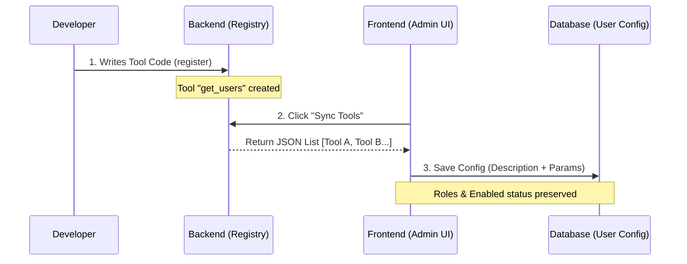
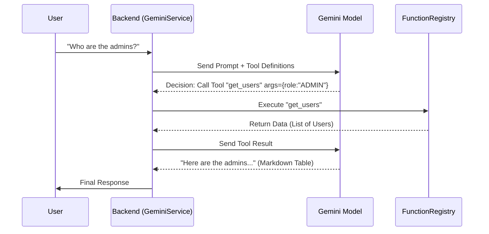

# AI Function Calling: Development Guide

This guide explains how to add new tools (functions) to the V-Label AI Assistant.

## Architecture Overview

The system uses a **Backend-First** approach for tool definitions.
1. **Backend (`server`)**: Defines the *Source of Truth* (Implementation + Metadata).
2. **Frontend (`client`)**: Discovers these definitions via API and configures the AI Model.

Flow:
`Admin Click "Sync"` -> `GET /api/v1/ai/functions/registry` -> `Update Admin Config` -> `AI Model Prompt`

## Visual Architecture

### 1. Tool Sync Process (Development Time)


### 2. Execution Process (Run Time)


---

## How to Add a New Tool

### Step 1: Implement & Register in Backend

Open `server/src/services/ai/function.registry.ts`.

Use `FunctionRegistry.register` to add your tool.

```typescript
// 1. Define the Tool Name
const TOOL_NAME = 'get_project_stats';

// 2. Register Implementation
FunctionRegistry.register(TOOL_NAME, async (params, context) => {
  // A. Security Check (CRITICAL)
  // Available: context.userId, context.userRole
  if (!['ADMIN', 'MANAGER'].includes(context.userRole)) {
    throw new Error('Permission denied');
  }

  // B. Parse Parameters
  const { projectId } = params;

  // C. Execute Logic (Prisma)
  const stats = await prisma.project.findUnique({
    where: { id: projectId },
    include: { _count: { select: { tasks: true } } }
  });

  // D. Return Result
  // Tip: Return descriptive messages along with data
  return {
    projectId,
    taskCount: stats?._count.tasks,
    message: `Project has ${stats?._count.tasks} tasks.`
  };

}, {
  // 3. Define Metadata (Used by AI to understand the tool)
  description: 'Get statistics for a specific project including task counts.',
  parameters: {
    type: 'object',
    properties: {
      projectId: { 
        type: 'string', 
        description: 'UUID of the project to analyze' 
      }
    },
    required: ['projectId']
  }
});
```

### Step 2: Sync with Frontend

1. Go to **Admin Panel > AI Chat > Tools & Functions**.
2. Click the **"Sync"** button (Refresh icon).
3. The system will scan your backend code and add `get_project_stats` to the list.
4. (Optional) You can toggle `Enabled` or adjust `Allowed Roles` in the UI if you want to restrict it further, but the Backend Security Check (Step 1A) is the primary enforcement.

---

## Output Formatting Best Practices

The AI Assistant is trained to render data in specific ways. To ensure the best UI experience:

### Lists & Tables
If your tool returns a list of items (users, logs, tasks), the AI prompt instructions (`rolePrompts.ts`) force it to render a **Markdown Table**.

**DO:** Return clean, structured JSON arrays.
```json
{
  "users": [
    { "name": "A", "role": "ADMIN" },
    { "name": "B", "role": "USER" }
  ]
}
```

**DON'T:** Return pre-formatted text or ASCII tables. Let the UI handle the rendering via `remark-gfm`.

---

## Troubleshooting

### AI Calls the tool but returns empty text
*   **Cause**: The AI couldn't parse the JSON result or failed to generate a summary.
*   **Fix**: Check `GeminiService` logs. Ensure your tool returns a `message` field text that summarizes the result to help the AI.

### Parameters are missing
*   **Cause**: JSON Schema in `parameters` metadata is incomplete.
*   **Fix**: Be explicit in `properties` and `description`. Use default values in your code if the AI tends to omit optional params.

### Permission Denied
*   **Cause**: `context.userRole` check failed.
*   **Fix**: Ensure the user has the correct role. The error message returned by your function will be shown to the user by the AI.
