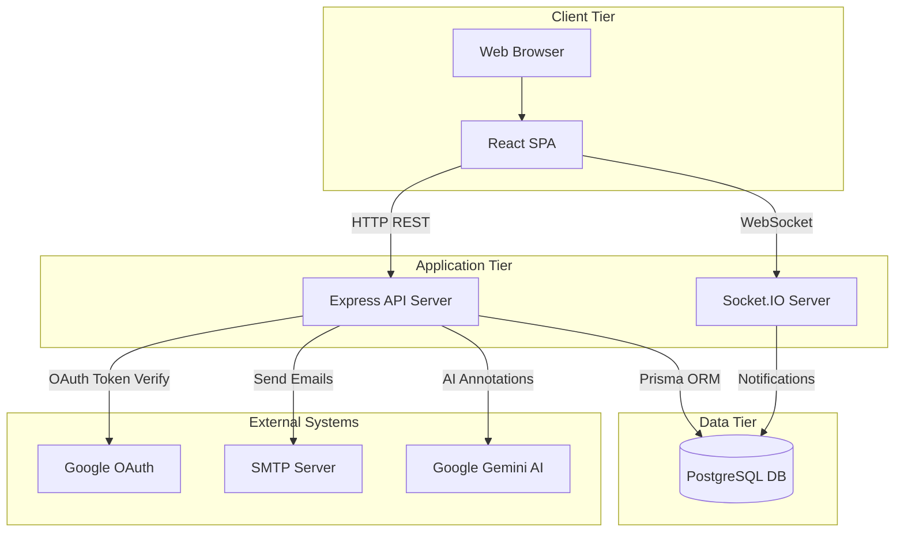
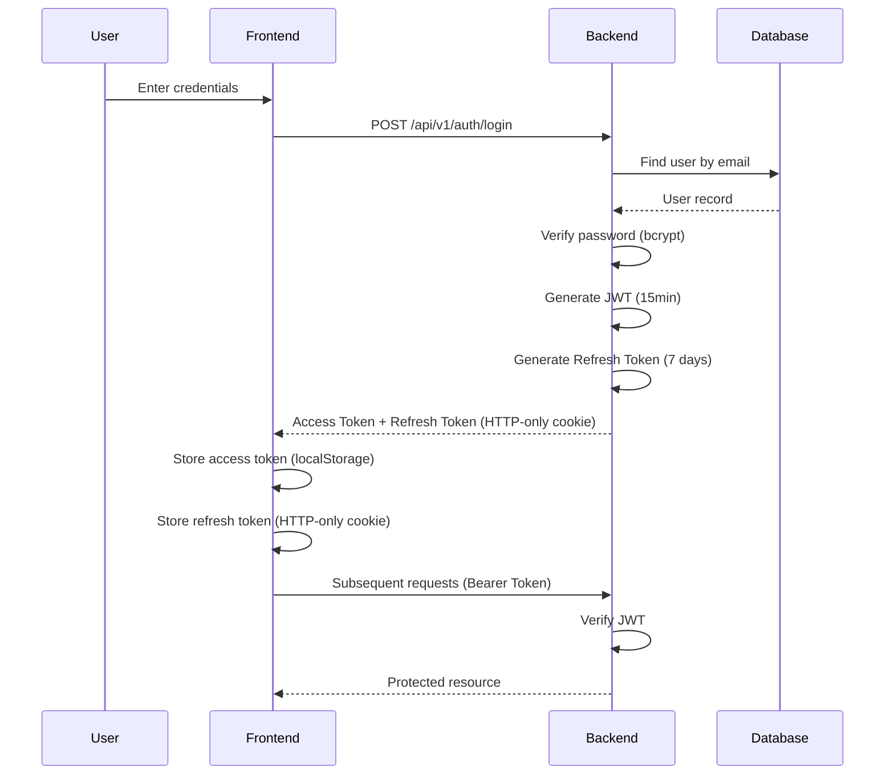

# System Architecture Documentation

> Comprehensive guide to V-Label's system design, architectural patterns, and technical implementation

**Last Updated:** 2026-01-19  
**Architecture Version:** v1.0  
**Stack:** React 19 + Express 5 + PostgreSQL 15 + Socket.IO 4.8

---

## Table of Contents

1. [System Overview](#system-overview)
2. [Architecture Principles](#architecture-principles)
3. [High-Level Architecture](#high-level-architecture)
4. [Backend Architecture](#backend-architecture)
5. [Frontend Architecture](#frontend-architecture)
6. [Communication Patterns](#communication-patterns)
7. [Data Flow](#data-flow)
8. [Security Architecture](#security-architecture)
9. [Scalability Considerations](#scalability-considerations)
10. [Design Patterns](#design-patterns)

---

## System Overview

### Technology Stack Summary

```
┌─────────────────────────────────────────────────────────────┐
│                     CLIENT TIER                             │
│  ┌───────────────────────────────────────────────────────┐  │
│  │  React 19 + TypeScript + Vite                         │  │
│  │  - React Router DOM 7.12                              │  │
│  │  - Context API (Auth, Socket)                         │  │
│  │  - Axios HTTP Client                                  │  │
│  │  - Konva Canvas (Annotations)                         │  │
│  │  - Socket.IO Client (WebSocket)                       │  │
│  │  - Tailwind CSS + shadcn/ui                           │  │
│  └───────────────────────────────────────────────────────┘  │
│                         Port: 5173                          │
└─────────────────────────────────────────────────────────────┘
                              ↕ HTTP/HTTPS + WebSocket
┌─────────────────────────────────────────────────────────────┐
│                   APPLICATION TIER                          │
│  ┌───────────────────────────────────────────────────────┐  │
│  │  Node.js 18+ + Express 5.2 + TypeScript               │  │
│  │  - RESTful API (6 route modules)                      │  │
│  │  - Socket.IO Server (Real-time)                       │  │
│  │  - JWT Authentication                                 │  │
│  │  - Middleware Stack (Auth, RBAC, Logging, Errors)    │  │
│  │  - Service Layer (Business Logic)                    │  │
│  │  - Prisma ORM                                         │  │
│  └───────────────────────────────────────────────────────┘  │
│                         Port: 4000                          │
└─────────────────────────────────────────────────────────────┘
                              ↕ TCP/IP
┌─────────────────────────────────────────────────────────────┐
│                     DATA TIER                               │
│  ┌───────────────────────────────────────────────────────┐  │
│  │  PostgreSQL 15/16                                     │  │
│  │  - 14 Tables (Users, Projects, Tasks, etc.)          │  │
│  │  - JSONB for flexible data                           │  │
│  │  - Indexes for performance                           │  │
│  │  - Prisma Migrations                                 │  │
│  └───────────────────────────────────────────────────────┘  │
│                         Port: 5433                          │
└─────────────────────────────────────────────────────────────┘
```

### Core Architectural Characteristics

| Aspect | Description |
|--------|-------------|
| **Architecture Style** | Layered Monolith (3-tier) |
| **API Style** | RESTful + WebSocket (hybrid) |
| **Authentication** | JWT (stateless) with HTTP-only refresh tokens |
| **State Management** | React Context API (Frontend), Service Layer (Backend) |
| **Communication** | HTTP/REST (data operations) + Socket.IO (real-time) |
| **Database** | PostgreSQL (ACID-compliant RDBMS) |
| **ORM** | Prisma (type-safe query builder) |
| **Type Safety** | End-to-end TypeScript |
| **Build Tool** | Vite (Frontend), TSX (Backend) |

---

## Architecture Principles

### 1. Separation of Concerns

**Principle:** Each layer has a single, well-defined responsibility

**Implementation:**

```
Frontend:
  UI Components → Business Logic (Services) → State Management (Context)

Backend:
  Routes → Controllers → Services → Database (Prisma)
```

**Benefits:**
- ✅ Easier testing (mock individual layers)
- ✅ Code reusability
- ✅ Independent scalability

---

### 2. Type Safety First

**Principle:** Leverage TypeScript end-to-end for compile-time safety

**Implementation:**

```typescript
// Shared types between frontend and backend
interface User {
  id: string;
  email: string;
  role: 'ADMIN' | 'MANAGER' | 'REVIEWER' | 'ANNOTATOR';
}

// Prisma generates types from database schema
const user: User = await prisma.user.findUnique({...});

// API responses are typed
const response: ApiResponse<User> = await authApi.login(...)
```

**Benefits:**
- ✅ Catch errors at compile time
- ✅ IntelliSense/autocomplete
- ✅ Refactoring safety

---

### 3. Single Source of Truth

**Principle:** Centralize configuration and state

**Implementation:**

```
Environment Configuration:
  server/.env → server/src/config/env.ts
  
Authentication State:
  client/src/context/AuthContext.tsx (single global state)
  
WebSocket Connection:
  client/src/context/SocketContext.tsx (managed once)
```

**Benefits:**
- ✅ No state synchronization issues
- ✅ Predictable behavior
- ✅ Easier debugging

---

### 4. Fail Fast & Defensive Programming

**Principle:** Validate early, handle errors gracefully

**Implementation:**

```typescript
// Input validation (Zod schemas)
const loginSchema = z.object({
  email: z.string().email(),
  password: z.string().min(8)
});

// Middleware error handling
app.use(errorHandler); // Global error catcher

// Defensive null checks
const user = await prisma.user.findUnique({...});
if (!user) throw new NotFoundError('User not found');
```

**Benefits:**
- ✅ Prevent cascading failures
- ✅ Clear error messages
- ✅ Easier debugging

---

## High-Level Architecture

### System Context Diagram



### Component Interaction Flow

```
┌─────────────────────────────────────────────────────────────┐
│  User Action: Create Annotation                            │
└─────────────────────────────────────────────────────────────┘
                          ↓
┌─────────────────────────────────────────────────────────────┐
│  Frontend (React)                                           │
│  ┌──────────────────────────────────────────────────────┐  │
│  │  1. User draws on Konva Canvas                       │  │
│  │  2. Component calls `annotationApi.submit(...)`      │  │
│  │  3. Axios sends POST /api/v1/annotations             │  │
│  └──────────────────────────────────────────────────────┘  │
└─────────────────────────────────────────────────────────────┘
                          ↓ HTTP POST + JWT Header
┌─────────────────────────────────────────────────────────────┐
│  Backend (Express)                                          │
│  ┌──────────────────────────────────────────────────────┐  │
│  │  4. authMiddleware → validates JWT                   │  │
│  │  5. roleMiddleware → checks ANNOTATOR permission     │  │
│  │  6. Controller → calls AnnotationService             │  │
│  │  7. Service → validates data, saves to DB            │  │
│  │  8. Service → triggers notification event            │  │
│  └──────────────────────────────────────────────────────┘  │
└─────────────────────────────────────────────────────────────┘
                          ↓ Prisma Query
┌─────────────────────────────────────────────────────────────┐
│  Database (PostgreSQL)                                      │
│  ┌──────────────────────────────────────────────────────┐  │
│  │  9. INSERT INTO task_assignments (annotations=...)   │  │
│  │  10. INSERT INTO notifications (type='TASK_SUBMITTED')│  │
│  └──────────────────────────────────────────────────────┘  │
└─────────────────────────────────────────────────────────────┘
                          ↓ Socket.IO Emit
┌─────────────────────────────────────────────────────────────┐
│  Socket.IO Server                                           │
│  ┌──────────────────────────────────────────────────────┐  │
│  │  11. Emit 'new_notification' to reviewer's room      │  │
│  └──────────────────────────────────────────────────────┘  │
└─────────────────────────────────────────────────────────────┘
                          ↓ WebSocket Push
┌─────────────────────────────────────────────────────────────┐
│  Frontend (React - Reviewer's Browser)                     │
│  ┌──────────────────────────────────────────────────────┐  │
│  │  12. SocketContext receives event                    │  │
│  │  13. Updates notification badge (real-time UI update)│  │
│  └──────────────────────────────────────────────────────┘  │
└─────────────────────────────────────────────────────────────┘
```

---

## Backend Architecture

### Layered Architecture Pattern

```
┌─────────────────────────────────────────────────────────────┐
│  LAYER 1: Entry Point & HTTP Server                        │
│  ┌──────────────────────────────────────────────────────┐  │
│  │  index.ts                                            │  │
│  │  - Express app initialization                        │  │
│  │  - HTTP server creation                              │  │
│  │  - Socket.IO initialization                          │  │
│  │  - Global middleware registration                    │  │
│  │  - Error handlers                                    │  │
│  └──────────────────────────────────────────────────────┘  │
└─────────────────────────────────────────────────────────────┘
                          ↓
┌─────────────────────────────────────────────────────────────┐
│  LAYER 2: Middleware Stack                                 │
│  ┌──────────────────────────────────────────────────────┐  │
│  │  middlewares/                                        │  │
│  │  ├─ request-logger.ts    → Logs all requests         │  │
│  │  ├─ auth.middleware.ts   → JWT validation            │  │
│  │  ├─ role.middleware.ts   → RBAC enforcement          │  │
│  │  └─ error-handler.ts     → Global error handling     │  │
│  └──────────────────────────────────────────────────────┘  │
└─────────────────────────────────────────────────────────────┘
                          ↓
┌─────────────────────────────────────────────────────────────┐
│  LAYER 3: Routes (API Endpoints)                           │
│  ┌──────────────────────────────────────────────────────┐  │
│  │  routes/                                             │  │
│  │  ├─ auth.routes.ts       → /api/v1/auth/*           │  │
│  │  ├─ user.routes.ts       → /api/v1/users/*          │  │
│  │  ├─ admin.routes.ts      → /api/v1/admin/*          │  │
│  │  ├─ notification.routes  → /api/v1/notifications/*  │  │
│  │  ├─ chat.routes.ts       → /api/v1/chat/*           │  │
│  │  └─ ai.routes.ts         → /api/v1/ai/*             │  │
│  └──────────────────────────────────────────────────────┘  │
└─────────────────────────────────────────────────────────────┘
                          ↓
┌─────────────────────────────────────────────────────────────┐
│  LAYER 4: Controllers (Request Handling)                   │
│  ┌──────────────────────────────────────────────────────┐  │
│  │  controllers/                                        │  │
│  │  ├─ auth.controller.ts   → Parse req, call service  │  │
│  │  ├─ user.controller.ts   → Validate input           │  │
│  │  ├─ admin.controller.ts  → Format response          │  │
│  │  └─ ai.controller.ts     → Error handling           │  │
│  └──────────────────────────────────────────────────────┘  │
└─────────────────────────────────────────────────────────────┘
                          ↓
┌─────────────────────────────────────────────────────────────┐
│  LAYER 5: Services (Business Logic)                        │
│  ┌──────────────────────────────────────────────────────┐  │
│  │  services/                                           │  │
│  │  ├─ auth.service.ts          → Login, JWT generation│  │
│  │  ├─ firebaseAuth.service.ts  → Google OAuth         │  │
│  │  ├─ password-reset.service.ts→ Token management     │  │
│  │  ├─ gemini.service.ts        → AI integration       │  │
│  │  ├─ system.config.service.ts → Config management    │  │
│  │  └─ email/                   → Email services       │  │
│  │      ├─ email.service.ts     → Send emails          │  │
│  │      └─ template.service.ts  → Template management  │  │
│  └──────────────────────────────────────────────────────┘  │
└─────────────────────────────────────────────────────────────┘
                          ↓
┌─────────────────────────────────────────────────────────────┐
│  LAYER 6: Database Access (Prisma ORM)                     │
│  ┌──────────────────────────────────────────────────────┐  │
│  │  utils/database.ts                                   │  │
│  │  - Prisma Client instance                            │  │
│  │  - Connection management                             │  │
│  │  - Type-safe queries                                 │  │
│  └──────────────────────────────────────────────────────┘  │
└─────────────────────────────────────────────────────────────┘
                          ↓
┌─────────────────────────────────────────────────────────────┐
│  LAYER 7: PostgreSQL Database                              │
│  14 tables, JSONB support, indexes                         │
└─────────────────────────────────────────────────────────────┘
```

### Backend Folder Structure

```
server/src/
├── config/
│   ├── env.ts                  # Environment variable configuration
│   └── firebase-admin.ts       # Firebase Admin SDK setup
│
├── controllers/                # Request/Response handling
│   ├── auth.controller.ts      # Login, register, logout
│   ├── user.controller.ts      # User CRUD operations
│   ├── admin.controller.ts     # Admin-only operations
│   └── ai.controller.ts        # AI annotation endpoints
│
├── middlewares/                # Request interceptors
│   ├── auth.middleware.ts      # JWT validation
│   ├── role.middleware.ts      # RBAC (role-based access control)
│   ├── request-logger.ts       # HTTP request logging
│   └── error-handler.ts        # Global error handling
│
├── routes/                     # API route definitions
│   ├── auth.routes.ts          # POST /login, /register, etc.
│   ├── user.routes.ts          # GET /users/:id, PUT /users/:id
│   ├── admin.routes.ts         # Admin-only endpoints
│   ├── notification.routes.ts  # Notification CRUD
│   ├── chat.routes.ts          # Project chat
│   └── ai.routes.ts            # AI-assisted annotation
│
├── services/                   # Business logic layer
│   ├── auth.service.ts         # Authentication logic
│   ├── firebaseAuth.service.ts # Google OAuth integration
│   ├── password-reset.service.ts
│   ├── gemini.service.ts       # Google Gemini AI integration
│   ├── system.config.service.ts # System settings
│   └── email/
│       ├── email.service.ts    # Email sending
│       └── template.service.ts # Email templates
│
├── websocket/                  # Real-time communication
│   ├── socket.server.ts        # Socket.IO initialization
│   ├── handlers/
│   │   ├── notification.handler.ts
│   │   └── chat.handler.ts
│   └── types.ts                # WebSocket event types
│
├── utils/                      # Shared utilities
│   ├── database.ts             # Prisma client instance
│   ├── jwt.utils.ts            # JWT sign/verify
│   ├── password.utils.ts       # bcrypt hashing
│   └── logger.ts               # Winston logger
│
├── types/                      # TypeScript type definitions
│   └── role.ts                 # User role types
│
└── index.ts                    # Application entry point
```

### Request Flow Example

```typescript
// 1. Route Definition (routes/auth.routes.ts)
router.post('/login', authController.login);

// 2. Controller (controllers/auth.controller.ts)
async login(req: Request, res: Response) {
  const { email, password } = req.body;
  const result = await authService.login(email, password);
  res.json(result);
}

// 3. Service (services/auth.service.ts)
async login(email: string, password: string) {
  // Find user
  const user = await prisma.user.findUnique({ where: { email } });
  
  // Verify password
  const isValid = await verifyPassword(password, user.passwordHash);
  
  // Generate JWT
  const token = generateJWT({ userId: user.id, role: user.role });
  
  return { token, user };
}

// 4. Database (Prisma)
prisma.user.findUnique(...) // Type-safe query
```

---

## Frontend Architecture

### Component-Based Architecture

```
┌─────────────────────────────────────────────────────────────┐
│  LAYER 1: Application Shell                                │
│  ┌──────────────────────────────────────────────────────┐  │
│  │  main.tsx → App.tsx → BrowserRouter                  │  │
│  │  - Global styles                                     │  │
│  │  - Context providers (Auth, Socket)                  │  │
│  │  - Route configuration                               │  │
│  └──────────────────────────────────────────────────────┘  │
└─────────────────────────────────────────────────────────────┘
                          ↓
┌─────────────────────────────────────────────────────────────┐
│  LAYER 2: Global State (Context API)                       │
│  ┌──────────────────────────────────────────────────────┐  │
│  │  context/                                            │  │
│  │  ├─ AuthContext.tsx   → User auth state             │  │
│  │  └─ SocketContext.tsx → WebSocket connection        │  │
│  └──────────────────────────────────────────────────────┘  │
└─────────────────────────────────────────────────────────────┘
                          ↓
┌─────────────────────────────────────────────────────────────┐
│  LAYER 3: Routing & Layouts                                │
│  ┌──────────────────────────────────────────────────────┐  │
│  │  routes/AppRoutes.tsx                                │  │
│  │  - Role-based route protection                       │  │
│  │  - Lazy loading                                      │  │
│  │                                                       │  │
│  │  layouts/                                            │  │
│  │  └─ AuthSplitLayout.tsx → Login/Register UI         │  │
│  └──────────────────────────────────────────────────────┘  │
└─────────────────────────────────────────────────────────────┘
                          ↓
┌─────────────────────────────────────────────────────────────┐
│  LAYER 4: Feature Modules (Domain-Driven)                  │
│  ┌──────────────────────────────────────────────────────┐  │
│  │  features/                                           │  │
│  │  ├─ auth/         → Login, Register, ForgotPassword │  │
│  │  ├─ admin/        → User mgmt, Email settings       │  │
│  │  ├─ manager/      → Project mgmt, Task assignment   │  │
│  │  ├─ annotator/    → Annotation canvas               │  │
│  │  ├─ reviewer/     → Review dashboard                │  │
│  │  ├─ chat-widget/  → AI chat integration             │  │
│  │  ├─ annotation/   → Canvas tools (Konva)            │  │
│  │  └─ profile/      → User profile                    │  │
│  └──────────────────────────────────────────────────────┘  │
└─────────────────────────────────────────────────────────────┘
                          ↓
┌─────────────────────────────────────────────────────────────┐
│  LAYER 5: Shared Components                                │
│  ┌──────────────────────────────────────────────────────┐  │
│  │  components/                                         │  │
│  │  ├─ ui/             → Reusable UI (shadcn)          │  │
│  │  ├─ notifications/  → NotificationInbox              │  │
│  │  ├─ chat/           → MessageInput, MessageList     │  │
│  │  └─ ProtectedRoute.tsx → Auth guard                 │  │
│  └──────────────────────────────────────────────────────┘  │
└─────────────────────────────────────────────────────────────┘
                          ↓
┌─────────────────────────────────────────────────────────────┐
│  LAYER 6: Services & API Clients                           │
│  ┌──────────────────────────────────────────────────────┐  │
│  │  services/                                           │  │
│  │  ├─ auth.api.ts    → API client for auth endpoints  │  │
│  │  ├─ admin.api.ts   → Admin API client               │  │
│  │  └─ ai.service.ts  → Gemini AI integration          │  │
│  │                                                       │  │
│  │  api/axiosClient.ts → Axios instance with interceptors│
│  └──────────────────────────────────────────────────────┘  │
└─────────────────────────────────────────────────────────────┘
```

### Frontend Folder Structure

```
client/src/
├── main.tsx                    # Application entry point
├── App.tsx                     # Root component
│
├── context/                    # Global state management
│   ├── AuthContext.tsx         # User authentication state
│   └── SocketContext.tsx       # WebSocket connection
│
├── routes/                     # Route configuration
│   └── AppRoutes.tsx           # React Router setup
│
├── layouts/                    # Page layouts
│   └── AuthSplitLayout.tsx     # Split-screen auth layout
│
├── features/                   # Feature-based modules
│   ├── auth/
│   │   └── pages/
│   │       ├── LoginPage.tsx
│   │       ├── RegisterPage.tsx
│   │       ├── ForgotPasswordPage.tsx
│   │       └── ResetPasswordPage.tsx
│   │
│   ├── admin/
│   │   └── pages/
│   │       ├── AdminPanel.tsx
│   │       ├── AdminDashboardPage.tsx
│   │       ├── AdminUserDetailPage.tsx
│   │       └── AdminEmailSettingsPage.tsx
│   │
│   ├── manager/
│   │   ├── pages/
│   │   │   ├── ProjectListPage.tsx
│   │   │   └── ProjectDetailPage.tsx
│   │   └── data/
│   │       └── projects.mock.ts
│   │
│   ├── annotator/
│   │   └── pages/
│   │       └── AnnotatorDashboard.tsx
│   │
│   ├── reviewer/
│   │   └── pages/
│   │       └── ReviewerDashboard.tsx
│   │
│   ├── annotation/
│   │   └── components/
│   │       └── AnnotationCanvas.tsx  # Konva canvas
│   │
│   ├── chat-widget/
│   │   └── components/
│   │       ├── ChatWidget.tsx        # AI chatbot
│   │       └── ChatMessage.tsx
│   │
│   └── profile/
│       └── pages/
│           └── ProfilePage.tsx
│
├── components/                 # Shared components
│   ├── ui/                     # shadcn/ui components
│   │   ├── button.tsx
│   │   ├── card.tsx
│   │   ├── input.tsx
│   │   └── ...
│   │
│   ├── notifications/
│   │   └── NotificationInbox.tsx
│   │
│   ├── chat/
│   │   ├── MessageInput.tsx
│   │   └── MessageList.tsx
│   │
│   ├── GoogleLoginButton.tsx
│   ├── ProtectedRoute.tsx
│   └── ImpersonationBanner.tsx
│
├── services/                   # API clients
│   ├── auth.api.ts             # Auth endpoints
│   ├── admin.api.ts            # Admin endpoints
│   ├── project.api.ts          # Project endpoints
│   └── ai.service.ts           # Gemini AI client
│
├── api/
│   └── axiosClient.ts          # Axios setup with interceptors
│
├── hooks/                      # Custom React hooks
│   ├── useAuth.ts
│   └── useSocket.ts
│
├── utils/                      # Utility functions
│   └── logger.ts               # Console logger
│
├── types/                      # TypeScript types
│   └── user.types.ts
│
└── styles/
    └── globals.css             # Tailwind imports
```

### State Management Pattern

```typescript
// AuthContext.tsx - Centralized authentication state
interface AuthContextType {
  user: User | null;
  login: (email: string, password: string) => Promise<void>;
  logout: () => void;
  isAuthenticated: boolean;
  isImpersonating: boolean;
}

export const AuthProvider = ({ children }) => {
  const [user, setUser] = useState<User | null>(null);
  
  const login = async (email, password) => {
    const response = await authApi.login(email, password);
    setUser(response.user);
    localStorage.setItem('token', response.token);
  };
  
  return (
    <AuthContext.Provider value={{ user, login, ... }}>
      {children}
    </AuthContext.Provider>
  );
};

// Usage in components
const { user, logout } = useAuth();
```

### Component Communication Pattern

```
┌──────────────────────────────────────────────────────────┐
│  Parent Component (ProjectDetailPage)                   │
│  ┌────────────────────────────────────────────────────┐ │
│  │  State: selectedTask, annotations                  │ │
│  │  ┌──────────────────────────────────────────────┐  │ │
│  │  │  Child: TaskList                              │  │ │
│  │  │  Props: tasks, onTaskSelect                   │  │ │
│  │  │  Event: ↑ onTaskSelect(task) → parent updates │  │ │
│  │  └──────────────────────────────────────────────┘  │ │
│  │  ┌──────────────────────────────────────────────┐  │ │
│  │  │  Child: AnnotationCanvas                      │  │ │
│  │  │  Props: task, onAnnotationComplete            │  │ │
│  │  │  Event: ↑ onAnnotationComplete(data) → save   │  │ │
│  │  └──────────────────────────────────────────────┘  │ │
│  └────────────────────────────────────────────────────┘ │
└──────────────────────────────────────────────────────────┘

Props Down ↓ / Events Up ↑ (Unidirectional data flow)
```

---

## Communication Patterns

### 1. HTTP REST API (Synchronous)

**Use Case:** CRUD operations (Create, Read, Update, Delete)

**Pattern:**

```
Client                      Server
  │                           │
  ├─── POST /api/v1/auth/login ──→ Validate credentials
  │                           │     Generate JWT
  │                           │
  │←─── 200 OK + JWT token ───┤
  │                           │
  ├─── GET /api/v1/projects ──→ Query database
  │     (Header: Bearer JWT) │     Filter by user
  │                           │
  │←─── 200 OK + Projects ────┤
```

**Implementation:**

```typescript
// Frontend
const response = await axios.get('/api/v1/projects', {
  headers: { Authorization: `Bearer ${token}` }
});

// Backend Route
router.get('/projects', authMiddleware, projectController.list);

// Controller
async list(req, res) {
  const userId = req.user.id;
  const projects = await projectService.getProjectsForUser(userId);
  res.json(projects);
}
```

---

### 2. WebSocket (Real-Time Bidirectional)

**Use Case:** Real-time notifications, chat messages

**Pattern:**

```
Client                          Socket.IO Server
  │                                   │
  ├─── Connect (with JWT token) ────→ Authenticate
  │                                   │ Assign to user-specific room
  │←─── Connection Acknowledged ──────┤
  │                                   │
  │                                   │
  │         [Server-side event]       │
  │         User submits task         │
  │                                   │
  │←─── Emit: 'new_notification' ─────┤ (to reviewer)
  │     Data: { type, title, msg }    │
  │                                   │
  │                                   │
  ├─── Emit: 'mark_as_read' ─────────→ Update database
  │                                   │
  │←─── Ack ──────────────────────────┤
```

**Implementation:**

```typescript
// Frontend (SocketContext.tsx)
const socket = io('http://localhost:4000', {
  auth: { token: localStorage.getItem('token') }
});

socket.on('new_notification', (notification) => {
  // Update UI in real-time
  setNotifications(prev => [notification, ...prev]);
});

// Backend (websocket/socket.server.ts)
io.on('connection', (socket) => {
  const userId = socket.data.userId; // From JWT
  socket.join(`user:${userId}`); // Join user-specific room
  
  socket.on('mark_as_read', async (notificationId) => {
    await prisma.notification.update({
      where: { id: notificationId },
      data: { isRead: true }
    });
  });
});

// Emit to specific user
io.to(`user:${reviewerId}`).emit('new_notification', {...});
```

---

### 3. Third-Party API Integration

#### Google OAuth (Firebase Auth)

```
User                    Frontend              Firebase              Backend
 │                         │                     │                    │
 ├─ Click "Login with Google" ─→ Trigger popup  │                    │
 │                         ├───────────────────→ Google Login         │
 │                         │                     │                    │
 │                         │←─── ID Token ───────┤                    │
 │                         │                     │                    │
 │                         ├─────── POST /auth/google/callback ──────→│
 │                         │         (ID Token)  │                    │
 │                         │                     │                  Verify
 │                         │                     │                  token
 │                         │                     │                  Create/
 │                         │                     │                  find user
 │                         │←─── JWT + User ─────────────────────────┤
```

#### Google Gemini AI (Annotation Assistance)

```
Annotator              Frontend              Backend              Gemini API
 │                       │                      │                    │
 ├─ Request AI help ────→ POST /ai/annotate   │                    │
 │                       ├─────────────────────→ Validate image     │
 │                       │                      ├───────────────────→│
 │                       │                      │  Generate content  │
 │                       │                      │                    │
 │                       │                      │←─── Predictions ───┤
 │                       │                      │                    │
 │                       │                      │ Convert to         │
 │                       │                      │ annotation format  │
 │                       │←─── Annotations ─────┤                    │
 │←─ Display suggestions ┤                      │                    │
```

---

## Data Flow

### End-to-End Example: Annotation Submission Flow

```
┌─────────────────────────────────────────────────────────────┐
│  STEP 1: User Interaction (Frontend)                       │
└─────────────────────────────────────────────────────────────┘

User draws bounding box on AnnotationCanvas (Konva)
  ↓
Component captures annotation data:
  {
    type: "bbox",
    label: "car",
    coordinates: { x: 100, y: 200, width: 300, height: 150 }
  }
  ↓
User clicks "Submit" button
  ↓
Component calls: onSubmit(annotationData)

┌─────────────────────────────────────────────────────────────┐
│  STEP 2: API Call (Frontend Service Layer)                 │
└─────────────────────────────────────────────────────────────┘

annotationApi.submitTask(taskId, annotations)
  ↓
Axios POST request:
  URL: /api/v1/tasks/:taskId/submit
  Headers: { Authorization: "Bearer <JWT>" }
  Body: { annotations: {...} }

┌─────────────────────────────────────────────────────────────┐
│  STEP 3: Request Processing (Backend)                      │
└─────────────────────────────────────────────────────────────┘

Middleware Chain:
  1. requestLogger → Log request
  2. authMiddleware → Validate JWT, attach req.user
  3. roleMiddleware → Check if user is ANNOTATOR
  ↓
Route Handler:
  router.post('/:id/submit', authMiddleware, controller.submit)
  ↓
Controller:
  - Extract taskId, annotations from request
  - Call service.submitTask(taskId, userId, annotations)

┌─────────────────────────────────────────────────────────────┐
│  STEP 4: Business Logic (Service Layer)                    │
└─────────────────────────────────────────────────────────────┘

AnnotationService.submitTask(taskId, userId, annotations):
  1. Validate user has permission for this task
  2. Save annotations to database (Prisma)
  3. Update task status → IN_PROGRESS → SUBMITTED
  4. Auto-assign reviewer (business rule)
  5. Create notification for reviewer
  6. Update user reputation
  7. Log audit trail

┌─────────────────────────────────────────────────────────────┐
│  STEP 5: Database Operations (Prisma)                      │
└─────────────────────────────────────────────────────────────┘

Transaction:
  BEGIN;
  
  UPDATE task_assignments
  SET annotations = '{...}',
      status = 'SUBMITTED',
      updated_at = NOW()
  WHERE id = :assignmentId;
  
  UPDATE tasks
  SET status = 'IN_PROGRESS'
  WHERE id = :taskId;
  
  INSERT INTO notifications (user_id, type, title, message)
  VALUES (:reviewerId, 'TASK_SUBMITTED', ...);
  
  UPDATE users
  SET total_tasks_done = total_tasks_done + 1
  WHERE id = :userId;
  
  COMMIT;

┌─────────────────────────────────────────────────────────────┐
│  STEP 6: Real-Time Notification (WebSocket)                │
└─────────────────────────────────────────────────────────────┘

Service emits Socket.IO event:
  io.to(`user:${reviewerId}`).emit('new_notification', {
    type: 'TASK_SUBMITTED',
    title: 'New task ready for review',
    taskId: taskId
  });

┌─────────────────────────────────────────────────────────────┐
│  STEP 7: UI Update (Frontend - Reviewer's Browser)         │
└─────────────────────────────────────────────────────────────┘

SocketContext receives event:
  socket.on('new_notification', (data) => {
    setNotifications(prev => [data, ...prev]);
    // Update notification badge: 0 → 1
  });
  ↓
Notification inbox updates in real-time (no page refresh)

┌─────────────────────────────────────────────────────────────┐
│  STEP 8: Response to Original Request (HTTP)               │
└─────────────────────────────────────────────────────────────┘

Backend sends HTTP response:
  Status: 200 OK
  Body: {
    success: true,
    message: "Task submitted successfully",
    data: { assignmentId, status: "SUBMITTED" }
  }
  ↓
Frontend displays success toast:
  "✅ Task submitted for review"
  ↓
Navigate to next task or dashboard
```

---

## Security Architecture

### Authentication Flow



### Security Layers

```
┌─────────────────────────────────────────────────────────────┐
│  LAYER 1: Infrastructure Security                          │
│  ├─ HTTPS (TLS 1.2+) for all traffic                       │
│  ├─ Helmet.js (Security headers)                           │
│  ├─ CORS (Whitelist specific origins)                      │
│  └─ Rate Limiting (DDoS protection)                        │
└─────────────────────────────────────────────────────────────┘
┌─────────────────────────────────────────────────────────────┐
│  LAYER 2: Authentication                                    │
│  ├─ JWT (stateless tokens, 15min expiry)                   │
│  ├─ Refresh tokens (HTTP-only cookies, 7 days)             │
│  ├─ Password hashing (bcrypt, cost=12)                     │
│  └─ OAuth 2.0 (Google Sign-In)                             │
└─────────────────────────────────────────────────────────────┘
┌─────────────────────────────────────────────────────────────┐
│  LAYER 3: Authorization (RBAC)                              │
│  ├─ Role-based middleware (requireRole('ADMIN'))           │
│  ├─ Resource-level checks (owns this project?)             │
│  └─ Field-level permissions (can edit this field?)         │
└─────────────────────────────────────────────────────────────┘
┌─────────────────────────────────────────────────────────────┐
│  LAYER 4: Input Validation                                 │
│  ├─ Zod schemas (runtime validation)                       │
│  ├─ SQL injection prevention (Prisma parameterized queries)│
│  ├─ XSS prevention (React auto-escaping)                   │
│  └─ CSRF tokens (for state-changing operations)            │
└─────────────────────────────────────────────────────────────┘
┌─────────────────────────────────────────────────────────────┐
│  LAYER 5: Audit & Monitoring                               │
│  ├─ Audit logs (who did what, when)                        │
│  ├─ Request logging (Winston)                              │
│  ├─ Error tracking (structured logging)                    │
│  └─ Email logs (delivery tracking)                         │
└─────────────────────────────────────────────────────────────┘
```

### Security Best Practices Implemented

| Threat | Mitigation |
|--------|------------|
| **SQL Injection** | Prisma ORM (parameterized queries) |
| **XSS** | React auto-escaping + Content Security Policy |
| **CSRF** | SameSite cookies + CORS whitelist |
| **Session Hijacking** | JWT short expiry + refresh token rotation |
| **Brute Force** | Rate limiting (express-rate-limit) |
| **Password Leaks** | bcrypt hashing (cost=12), never store plain text |
| **Man-in-the-Middle** | HTTPS enforcement (production) |
| **Unauthorized Access** | JWT validation + RBAC middleware |
| **Data Exposure** | Selective field serialization (never send passwordHash) |

---

## Scalability Considerations

### Current Architecture (Monolith)

```
┌────────────┐      ┌────────────┐      ┌────────────┐
│  Client 1  │      │  Client 2  │      │  Client N  │
└─────┬──────┘      └─────┬──────┘      └─────┬──────┘
      │                   │                   │
      └───────────────────┼───────────────────┘
                          │
                   ┌──────▼──────┐
                   │   Nginx     │ (Optional load balancer)
                   └──────┬──────┘
                          │
     ┌────────────────────┼────────────────────┐
     │                    │                    │
┌────▼─────┐        ┌────▼─────┐        ┌────▼─────┐
│ Server 1 │        │ Server 2 │        │ Server N │
└────┬─────┘        └────┬─────┘        └────┬─────┘
     │                   │                    │
     └───────────────────┼────────────────────┘
                         │
                  ┌──────▼──────┐
                  │  PostgreSQL │
                  │  (Primary)  │
                  └─────────────┘
```

**Scalability Bottlenecks:**
- ❌ Single PostgreSQL instance (vertical scaling only)
- ❌ Stateful Socket.IO (sticky sessions required)
- ❌ No caching layer

---

### Future: Horizontal Scaling Strategy

```
┌─────────────────────────────────────────────────────────────┐
│  CDN (CloudFlare)                                           │
│  - Static assets (images, JS bundles)                      │
└────────────────────┬────────────────────────────────────────┘
                     │
┌────────────────────▼────────────────────────────────────────┐
│  Load Balancer (AWS ALB / Nginx)                            │
│  - Round-robin distribution                                │
│  - Health checks                                            │
└────────┬───────────────────────┬────────────────────────────┘
         │                       │
    ┌────▼─────┐            ┌────▼─────┐
    │ Server 1 │            │ Server N │  (Auto-scaling group)
    └────┬─────┘            └────┬─────┘
         │                       │
         └───────────┬───────────┘
                     │
         ┌───────────▼───────────┐
         │  Redis Cluster        │  (Session store + Cache)
         │  - Socket.IO adapter  │
         │  - Session sharing    │
         └───────────┬───────────┘
                     │
         ┌───────────▼───────────┐
         │  PostgreSQL           │
         │  ┌─────────────────┐  │
         │  │ Primary (Write) │  │
         │  └────────┬────────┘  │
         │           │           │
         │  ┌────────▼────────┐  │
         │  │ Replica (Read)  │  │ (Read replicas for queries)
         │  └─────────────────┘  │
         └───────────────────────┘
```

**Enhancements:**
- ✅ Redis for session sharing (Socket.IO adapter)
- ✅ PostgreSQL read replicas
- ✅ Stateless servers (horizontal scaling)
- ✅ CDN for static assets
- ✅ Message queue (RabbitMQ) for async tasks

---

## Design Patterns

### 1. Dependency Injection

**Problem:** Hard to test when services directly import other services

**Solution:** Inject dependencies via constructor

```typescript
// Bad: Hard-coded dependency
class UserService {
  async getUser(id: string) {
    return prisma.user.findUnique({ where: { id } }); // Tightly coupled
  }
}

// Good: Dependency injection
class UserService {
  constructor(private db: PrismaClient) {}
  
  async getUser(id: string) {
    return this.db.user.findUnique({ where: { id } });
  }
}

// Easy to mock in tests
const mockDb = { user: { findUnique: jest.fn() } };
const service = new UserService(mockDb);
```

---

### 2. Repository Pattern (Implicit via Prisma)

**Problem:** Direct database access scattered across codebase

**Solution:** Centralize data access through Prisma models

```typescript
// All queries go through Prisma
await prisma.user.findUnique({...});
await prisma.project.create({...});

// Future: Can wrap Prisma in custom Repository classes
class UserRepository {
  async findByEmail(email: string): Promise<User | null> {
    return prisma.user.findUnique({ where: { email } });
  }
}
```

---

### 3. Middleware Chain (Express)

**Pattern:** Request passes through chain of functions

```typescript
app.use(helmet());           // Security headers
app.use(cors());             // CORS handling
app.use(express.json());     // Body parsing
app.use(requestLogger);      // Logging
app.use(authMiddleware);     // Authentication
app.use(roleMiddleware);     // Authorization
app.use(errorHandler);       // Error handling
```

---

### 4. Context API (React)

**Problem:** Prop drilling (passing props through many levels)

**Solution:** Centralize state in Context

```typescript
// Without Context (prop drilling)
<App user={user}>
  <Dashboard user={user}>
    <Sidebar user={user}>
      <UserMenu user={user} /> {/* Props passed 4 levels */}
    </Sidebar>
  </Dashboard>
</App>

// With Context
<AuthProvider>
  <App>
    <Dashboard>
      <Sidebar>
        <UserMenu />  {/* Access via useAuth() */}
      </Sidebar>
    </Dashboard>
  </App>
</AuthProvider>
```

---

### 5. Observer Pattern (Socket.IO)

**Pattern:** Subscribers listen for events

```typescript
// Backend emits events
io.to(`user:${userId}`).emit('new_notification', data);

// Frontend subscribes
socket.on('new_notification', (data) => {
  // React to event
  setNotifications(prev => [data, ...prev]);
});
```

---

## Summary

### Architectural Strengths

1. ✅ **Clear Separation of Concerns** - Layered architecture (Routes → Controllers → Services → Database)
2. ✅ **Type Safety** - End-to-end TypeScript prevents runtime errors
3. ✅ **Scalability Ready** - Stateless JWT, horizontal scaling potential
4. ✅ **Real-Time Communication** - Socket.IO for instant notifications
5. ✅ **Developer Experience** - Hot reload, type inference, modular structure
6. ✅ **Security** - Multiple layers (JWT, RBAC, input validation, audit logs)

### Areas for Future Improvement

1. 📋 **Caching Layer** - Add Redis for session management and frequent queries
2. 📋 **Message Queue** - RabbitMQ/SQS for async tasks (email sending, AI processing)
3. 📋 **Service Mesh** - Migrate to microservices if complexity grows
4. 📋 **Monitoring** - APM tools (Datadog, New Relic) for performance tracking
5. 📋 **Testing** - Increase test coverage (unit, integration, E2E)

---

**Maintained by:** V-Label Development Team  
**Related Docs:** See `04_database.md`, `05_api.md`, `06_security.md`
