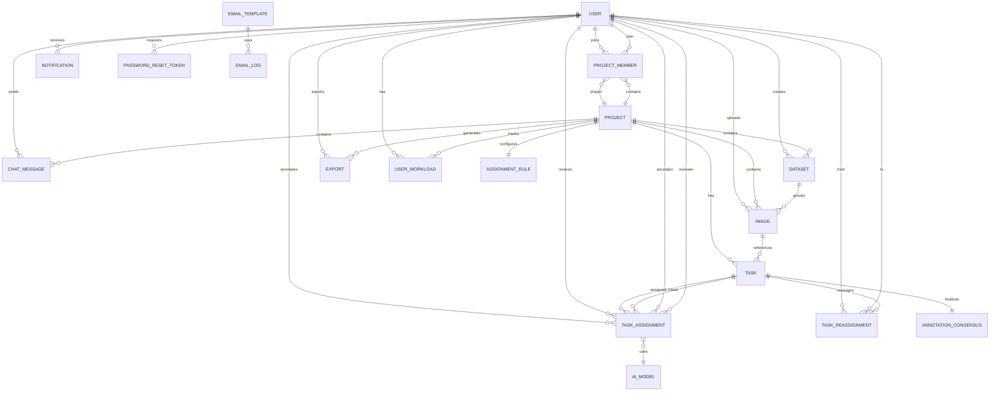

# Database Design Documentation

> Comprehensive guide to V-Label's PostgreSQL database architecture, design patterns, and implementation rationale

**Last Updated:** 2026-01-24 (Phase 2)
**Database Version:** PostgreSQL 15/16
**ORM:** Prisma 6.19
**Schema Migrations:** 12+ migrations applied
**Phase:** Production Ready (Phase 2 - ML Export & Auto-Assignment)

---

## Table of Contents

1. [Design Philosophy](#design-philosophy)
2. [Entity Relationship Diagram](#entity-relationship-diagram)
3. [Schema Overview](#schema-overview)
4. [Core Tables](#core-tables)
5. [Data Flow Patterns](#data-flow-patterns)
6. [Performance Optimizations](#performance-optimizations)
7. [Design Decisions & Rationale](#design-decisions--rationale)
8. [Migration History](#migration-history)

---

## Design Philosophy

### Core Principles

**1. Type Safety First**
- UUID primary keys for distributed system compatibility
- Enum types for strict value constraints
- JSONB for flexible, structured metadata

**2. Data Integrity**
- Foreign key constraints with CASCADE deletes
- NOT NULL constraints where business logic demands
- Unique constraints to prevent duplicates

**3. Audit Trail**
- `createdAt` and `updatedAt` timestamps on all core tables
- Dedicated `AuditLog` table for action tracking
- Email logs for communication history

**4. Scalability Ready**
- Indexed foreign keys for join performance
- Composite indexes for common query patterns
- JSONB for schema-less expansion

**5. Security by Design**
- Password hashes (never plain text)
- Token-based password resets with expiry
- Active/inactive user flags

---

## Entity Relationship Diagram

### High-Level Overview



### Detailed Relationship Breakdown

```
┌─────────────────────────────────────────────────────────────┐
│                      USER MANAGEMENT                        │
├─────────────────────────────────────────────────────────────┤
│  User                                                       │
│  ├─ 1:N → ProjectMember (joins projects)                   │
│  ├─ 1:N → TaskAssignment (as annotator)                    │
│  ├─ 1:N → TaskAssignment (as reviewer)                     │
│  ├─ 1:N → Notification (receives)                          │
│  ├─ 1:N → ChatMessage (sends)                              │
│  ├─ 1:N → PasswordResetToken (requests)                    │
│  ├─ 1:N → Image (uploads) ⭐ PHASE 2                       │
│  ├─ 1:N → Dataset (creates) ⭐ PHASE 2                     │
│  ├─ 1:N → Export (exports) ⭐ PHASE 2                      │
│  ├─ 1:N → UserWorkload (tracked) ⭐ PHASE 2                │
│  └─ 1:N → TaskReassignment (reassigns) ⭐ PHASE 2          │
└─────────────────────────────────────────────────────────────┘

┌─────────────────────────────────────────────────────────────┐
│                    PROJECT WORKFLOW                         │
├─────────────────────────────────────────────────────────────┤
│  Project                                                    │
│  ├─ 1:N → ProjectMember (M:N with User via junction)       │
│  ├─ 1:N → Task (images to label)                           │
│  ├─ 1:N → ChatMessage (project communication)              │
│  ├─ 1:N → Dataset (image groups) ⭐ PHASE 2                │
│  ├─ 1:N → Image (uploaded images) ⭐ PHASE 2               │
│  ├─ 1:N → Export (ML exports) ⭐ PHASE 2                   │
│  ├─ 1:1 → AssignmentRule (auto-assign config) ⭐ PHASE 2   │
│  └─ 1:N → UserWorkload (team workload) ⭐ PHASE 2          │
│                                                             │
│  Dataset ⭐ PHASE 2                                         │
│  ├─ N:1 → Project (belongs to)                             │
│  └─ 1:N → Image (contains images)                          │
│                                                             │
│  Image ⭐ PHASE 2                                           │
│  ├─ N:1 → Project (belongs to)                             │
│  ├─ N:1 → Dataset (optional, grouped by)                   │
│  └─ 1:N → Task (referenced in tasks)                       │
│                                                             │
│  Task                                                       │
│  ├─ N:1 → Project (belongs to)                             │
│  ├─ N:1 → Image (references) ⭐ PHASE 2                    │
│  ├─ 1:N → TaskAssignment (assigned to users)               │
│  ├─ 1:1 → AnnotationConsensus (final annotation) ⭐ PHASE 2│
│  └─ 1:N → TaskReassignment (history) ⭐ PHASE 2            │
│                                                             │
│  TaskAssignment                                             │
│  ├─ N:1 → Task (references)                                │
│  ├─ N:1 → User as annotator (assigned to)                  │
│  ├─ N:1 → User as reviewer (optional, assigned after)      │
│  ├─ N:1 → User as assignedBy ⭐ PHASE 2                    │
│  └─ N:1 → AiModel (optional, if AI-assisted) ⭐ PHASE 2    │
│                                                             │
│  AnnotationConsensus ⭐ PHASE 2                             │
│  ├─ 1:1 → Task (final annotation for export)               │
│  └─ N:1 → User as verifier (quality check)                 │
└─────────────────────────────────────────────────────────────┘

┌─────────────────────────────────────────────────────────────┐
│                  SUPPORT SYSTEMS                            │
├─────────────────────────────────────────────────────────────┤
│  - AuditLog (system actions tracking)                      │
│  - SystemConfig (key-value configuration)                  │
│  - EmailTemplate (notification templates)                  │
│  - EmailConfig (SMTP/provider settings)                    │
│  - EmailLog (email delivery tracking)                      │
└─────────────────────────────────────────────────────────────┘
```

---

## Schema Overview

### Database Statistics (Phase 2)

| Aspect | Count | Phase 2 Changes |
|--------|-------|----------------|
| **Total Tables** | 22 | +8 tables |
| **Core Workflow Tables** | 13 | +8 (Image, Dataset, AnnotationConsensus, Export, AiModel, AssignmentRule, UserWorkload, TaskReassignment) |
| **Communication Tables** | 2 | No change |
| **System Tables** | 3 | No change |
| **Email Service Tables** | 3 | No change |
| **Label Management Tables** | 4 | (From previous migration) |
| **Enum Types** | 10 | +5 (ProjectRole, TaskPriority, DifficultyLevel, AssignmentMethod, + enhancements) |
| **Total Indexes** | 30+ | +18 new indexes |
| **Foreign Keys** | 25+ | +15 new constraints |

### Table Categories

#### 1. **User Management** (2 tables)
- `users` - User accounts, roles, reputation
- `password_reset_tokens` - Secure password recovery

#### 2. **Project Workflow** (12 tables) ⭐ PHASE 2 ENHANCED
- `projects` - Labeling projects
- `project_members` - Many-to-many junction table (+ project_role)
- `tasks` - Individual images to annotate (+ priority, deadline, difficulty)
- `task_assignments` - Assignment and annotation data (+ AI tracking, rejection count)
- ⭐ `images` - Image metadata with dimensions for ML export
- ⭐ `datasets` - Group images by upload batch
- ⭐ `annotation_consensus` - Final annotations for ML export
- ⭐ `exports` - ML dataset export tracking (YOLO, COCO, etc.)
- ⭐ `ai_models` - AI model tracking for assisted annotation
- ⭐ `assignment_rules` - Auto-assignment configuration
- ⭐ `user_workload` - Real-time workload tracking
- ⭐ `task_reassignments` - Reassignment audit trail

#### 3. **Communication** (2 tables)
- `notifications` - In-app notifications
- `chat_messages` - Project-based team chat

#### 4. **System & Audit** (2 tables)
- `audit_logs` - Action tracking
- `system_configs` - Key-value settings

#### 5. **Email Service** (3 tables)
- `email_templates` - HTML/text templates
- `email_configs` - SMTP provider configs
- `email_logs` - Delivery history

#### 6. **Label Management** (4 tables)
- `label_categories` - Label categories
- `labels` - Global and project labels
- `project_labels` - Project-label associations
- `label_requests` - Label requests from annotators

---

## Core Tables

### 1. Users Table

**Purpose:** Central user management with authentication, roles, and reputation tracking

**Design Rationale:**
- **UUID Primary Key**: Distributed-friendly, non-sequential for security
- **Multiple Auth Providers**: Support both email/password and OAuth (Google)
- **Reputation System**: Gamification to incentivize quality work
- **Nullable Password**: Google users don't need passwords

```sql
CREATE TABLE "users" (
    "id" UUID PRIMARY KEY DEFAULT uuid_generate_v4(),
    "email" VARCHAR(255) UNIQUE NOT NULL,
    "google_id" VARCHAR(255) UNIQUE,
    "password_hash" VARCHAR(255),  -- Nullable for OAuth users
    "provider" TEXT DEFAULT 'LOCAL',
    
    "full_name" VARCHAR(255),
    "avatar_url" VARCHAR(512),
    "phone_number" VARCHAR(20),
    
    "role" TEXT DEFAULT 'ANNOTATOR',
    "is_active" BOOLEAN DEFAULT false,
    
    -- Reputation System
    "reputation_score" DOUBLE PRECISION DEFAULT 0,
    "total_tasks_done" INTEGER DEFAULT 0,
    
    "created_at" TIMESTAMP DEFAULT NOW(),
    "updated_at" TIMESTAMP DEFAULT NOW()
);
```

**Example Data:**

| id | email | role | reputation_score | total_tasks_done |
|----|-------|------|------------------|------------------|
| `550e8400-e29b-41d4-a716-446655440000` | john@example.com | ANNOTATOR | 85.5 | 42 |
| `660e8400-e29b-41d4-a716-446655440001` | alice@example.com | REVIEWER | 95.2 | 120 |
| `770e8400-e29b-41d4-a716-446655440002` | admin@vlabel.com | ADMIN | 100.0 | 0 |

**Key Design Decisions:**

✅ **Why UUID?**
- Distributed system friendly (can generate IDs on client)
- Non-sequential prevents enumeration attacks
- No collision risk when scaling horizontally

✅ **Why Nullable Password?**
- Google OAuth users authenticate via tokens
- Forcing empty strings would be semantically incorrect
- `passwordHash IS NULL AND provider = 'GOOGLE'` is explicit

✅ **Why Reputation Score?**
- Incentivizes high-quality annotations
- Enables task routing to best performers
- Provides leaderboard and gamification

---

### 2. Projects Table

**Purpose:** Container for labeling campaigns with custom label configurations

**Design Rationale:**
- **JSONB Label Config**: Flexible schema for any label type (bbox, polygon, keypoint)
- **AI Assistance Flag**: Per-project control over AI features
- **Status Lifecycle**: Clear project states (DRAFT → ACTIVE → COMPLETED)

```sql
CREATE TABLE "projects" (
    "id" UUID PRIMARY KEY DEFAULT uuid_generate_v4(),
    "name" VARCHAR(255) NOT NULL,
    "description" TEXT,
    
    -- Flexible label schema
    "label_config" JSONB DEFAULT '[]',
    
    "deadline" TIMESTAMP,
    "enable_ai_assistance" BOOLEAN DEFAULT false,
    "status" TEXT DEFAULT 'ACTIVE',
    
    "created_at" TIMESTAMP DEFAULT NOW(),
    "updated_at" TIMESTAMP DEFAULT NOW()
);
```

**Example Label Configuration (JSONB):**

```json
{
  "label_config": [
    {
      "id": "person",
      "name": "Person",
      "color": "#FF6B6B",
      "type": "bbox",
      "hotkey": "1"
    },
    {
      "id": "car",
      "name": "Car",
      "color": "#4ECDC4",
      "type": "bbox",
      "hotkey": "2"
    },
    {
      "id": "bicycle",
      "name": "Bicycle",
      "color": "#45B7D1",
      "type": "polygon",
      "hotkey": "3"
    }
  ]
}
```

**Project Status Lifecycle:**

```
DRAFT ────> ACTIVE ────> PAUSED ────> COMPLETED ────> ARCHIVED
  ↓            ↓            ↓             ↑              ↑
  └────────────┴────────────┴─────────────┘              │
                                                         │
                  Manual Archive ─────────────────────────┘
```

**Key Design Decisions:**

✅ **Why JSONB for Labels?**
- Schema varies per project (object detection vs segmentation)
- Avoid EAV anti-pattern (Entity-Attribute-Value tables)
- PostgreSQL JSONB is indexed and queryable
- Eliminates need for complex joins

✅ **Why Per-Project AI Flag?**
- Some projects need human-only labels (benchmarks)
- Others benefit from AI pre-annotation (large datasets)
- Centralized control at project level

---

### 3. Tasks Table

**Purpose:** Individual images to be annotated

**Design Rationale:**
- **Lightweight**: Only stores image_url and status
- **Cascade Delete**: Deleting project removes all tasks
- **One Task → Many Assignments**: Same image can be annotated by multiple users for consensus

```sql
CREATE TABLE "tasks" (
    "id" UUID PRIMARY KEY DEFAULT uuid_generate_v4(),
    "project_id" UUID NOT NULL REFERENCES "projects"(id) ON DELETE CASCADE,
    "image_url" TEXT NOT NULL,
    "status" TEXT DEFAULT 'TODO',
    
    FOREIGN KEY ("project_id") REFERENCES "projects"("id") ON DELETE CASCADE
);

CREATE INDEX "idx_tasks_project_id" ON "tasks"("project_id");
CREATE INDEX "idx_tasks_status" ON "tasks"("status");
```

**Task Status Flow:**

```
TODO ──────> IN_PROGRESS ──────> DONE
  ↑               ↓                 ↓
  └───────────────┘   (reassign)   └──> (exported)
```

**Key Design Decisions:**

✅ **Why Separate Tasks from Assignments?**
- Same image can have multiple assignments (consensus labeling)
- Task status aggregates from all assignments
- Enables rework without duplicating image URLs

---

### 4. TaskAssignment Table

**Purpose:** Links users to tasks with annotation data and review workflow

**Design Rationale:**
- **Dual User References**: Annotator (required) + Reviewer (optional later)
- **JSONB Annotations**: Flexible storage for any annotation type
- **Review Scoring**: 1-10 scale for quality tracking
- **Status Machine**: Clear workflow states

```sql
CREATE TABLE "task_assignments" (
    "id" UUID PRIMARY KEY DEFAULT uuid_generate_v4(),
    "task_id" UUID NOT NULL REFERENCES "tasks"(id) ON DELETE CASCADE,
    
    -- Worker and Reviewer
    "annotator_id" UUID NOT NULL REFERENCES "users"(id),
    "reviewer_id" UUID REFERENCES "users"(id),  -- Nullable initially
    
    "status" TEXT DEFAULT 'ASSIGNED',
    "deadline" TIMESTAMP,
    
    -- Annotation Data
    "annotations" JSONB,  -- Stores bboxes, polygons, etc.
    "is_ai_generated" BOOLEAN DEFAULT false,
    
    -- Feedback Loop
    "annotator_note" TEXT,
    "review_score" INTEGER CHECK ("review_score" BETWEEN 1 AND 10),
    "review_comment" TEXT,
    
    "created_at" TIMESTAMP DEFAULT NOW(),
    "updated_at" TIMESTAMP DEFAULT NOW()
);
```

**Example Annotation Data (JSONB):**

```json
{
  "annotations": {
    "objects": [
      {
        "id": "obj_1",
        "label": "person",
        "type": "bbox",
        "coordinates": {
          "x": 100,
          "y": 150,
          "width": 200,
          "height": 300
        },
        "confidence": 0.95,  // If AI-generated
        "is_ai_suggested": true
      },
      {
        "id": "obj_2",
        "label": "car",
        "type": "polygon",
        "points": [
          {"x": 50, "y": 50},
          {"x": 150, "y": 50},
          {"x": 150, "y": 150},
          {"x": 50, "y": 150}
        ],
        "is_ai_suggested": false
      }
    ],
    "metadata": {
      "annotator_time_spent_seconds": 120,
      "tool_used": "konva_v1.0"
    }
  }
}
```

**Assignment Status Workflow:**

```
ASSIGNED ──> IN_PROGRESS ──> SUBMITTED
                               │
                               ├─> APPROVED ──> (reputation +)
                               │
                               ├─> REJECTED ──> IN_PROGRESS (rework)
                               │
                               └─> SKIPPED (no reputation change)
```

**Key Design Decisions:**

✅ **Why Separate Annotator and Reviewer Fields?**
- Different users, different permissions
- Reviewer assigned after submission
- Prevents self-review (add constraint later)

✅ **Why JSONB for Annotations?**
- Annotation types vary (bbox, polygon, keypoint, segmentation)
- Adding new annotation types doesn't require migrations
- Full-text search capabilities if needed

✅ **Why Review Score (1-10)?**
- More granular than binary approve/reject
- Enables reputation calculation: `reputation += (score - 5) * 2`
- Identifies high/low quality work

---

### 5. ProjectMember (Junction Table)

**Purpose:** Many-to-many relationship between users and projects

**Design Rationale:**
- **Composite Unique Constraint**: One user can't join same project twice
- **Cascade Delete**: Removing project/user removes memberships
- **Join Date Tracking**: Audit when users joined

```sql
CREATE TABLE "project_members" (
    "id" UUID PRIMARY KEY DEFAULT uuid_generate_v4(),
    "project_id" UUID NOT NULL REFERENCES "projects"(id) ON DELETE CASCADE,
    "user_id" UUID NOT NULL REFERENCES "users"(id) ON DELETE CASCADE,
    "joined_at" TIMESTAMP DEFAULT NOW(),
    
    UNIQUE("project_id", "user_id")
);

CREATE INDEX "idx_project_members_project_id" ON "project_members"("project_id");
CREATE INDEX "idx_project_members_user_id" ON "project_members"("user_id");
```

**Query Example:**

```sql
-- Get all projects for a user
SELECT p.* FROM projects p
INNER JOIN project_members pm ON p.id = pm.project_id
WHERE pm.user_id = '550e8400-e29b-41d4-a716-446655440000';

-- Get all members of a project
SELECT u.* FROM users u
INNER JOIN project_members pm ON u.id = pm.user_id
WHERE pm.project_id = '660e8400-e29b-41d4-a716-446655440001';
```

---

### 6. Notifications Table

**Purpose:** In-app notification system

**Design Rationale:**
- **Type Enum**: Predefined notification categories
- **JSONB Metadata**: Store contextual data (task_id, project_name, etc.)
- **Composite Index**: Fast queries for unread notifications per user

```sql
CREATE TABLE "notifications" (
    "id" UUID PRIMARY KEY DEFAULT uuid_generate_v4(),
    "user_id" UUID NOT NULL REFERENCES "users"(id) ON DELETE CASCADE,
    "type" TEXT NOT NULL,
    "title" VARCHAR(255) NOT NULL,
    "message" TEXT NOT NULL,
    "metadata" JSONB,
    "is_read" BOOLEAN DEFAULT false,
    "created_at" TIMESTAMP DEFAULT NOW()
);

CREATE INDEX "idx_notifications_user_read" ON "notifications"("user_id", "is_read");
```

**Notification Types:**

| Type | Trigger | Example |
|------|---------|---------|
| `TASK_ASSIGNED` | Manager assigns task | "You have been assigned 5 new tasks" |
| `TASK_SUBMITTED` | Annotator submits | "Task #123 submitted for review" (to reviewer) |
| `TASK_APPROVED` | Reviewer approves | "Your task #123 was approved (+2 reputation)" |
| `TASK_REJECTED` | Reviewer rejects | "Task #123 needs rework (see feedback)" |
| `DEADLINE_WARNING` | Cron job | "Task #123 due in 2 hours" |
| `COMMENT_MENTION` | User @mentions | "@john mentioned you in project chat" |

**Example Metadata:**

```json
{
  "metadata": {
    "task_id": "abc-123",
    "project_id": "def-456",
    "project_name": "Street Scene Annotation",
    "reviewer_name": "Alice Smith",
    "review_score": 8,
    "link_url": "/tasks/abc-123"
  }
}
```

---

### 7. ChatMessage Table

**Purpose:** Project-based team communication

**Design Rationale:**
- **Project Scoped**: Messages belong to specific projects
- **Composite Index**: Fast message retrieval sorted by time
- **Cascade Delete**: Deleting project removes all messages

```sql
CREATE TABLE "chat_messages" (
    "id" UUID PRIMARY KEY DEFAULT uuid_generate_v4(),
    "project_id" UUID NOT NULL REFERENCES "projects"(id) ON DELETE CASCADE,
    "sender_id" UUID NOT NULL REFERENCES "users"(id) ON DELETE CASCADE,
    "content" TEXT NOT NULL,
    "created_at" TIMESTAMP DEFAULT NOW()
);

CREATE INDEX "idx_chat_project_time" ON "chat_messages"("project_id", "created_at");
```

**Key Design Decisions:**

✅ **Why Project-Scoped?**
- Communication context is project-specific
- Easy to implement project-wise chat rooms
- Can add DM later with nullable project_id

---

### 8. AuditLog Table

**Purpose:** Track all significant system actions

**Design Rationale:**
- **Actor Tracking**: Who performed the action
- **Target Tracking**: What/who was affected (optional)
- **JSONB Metadata**: Flexible action details

```sql
CREATE TABLE "audit_logs" (
    "id" UUID PRIMARY KEY DEFAULT uuid_generate_v4(),
    "action" VARCHAR(255) NOT NULL,
    "actor_id" UUID NOT NULL,
    "target_id" UUID,
    "metadata" JSONB,
    "created_at" TIMESTAMP DEFAULT NOW()
);

CREATE INDEX "idx_audit_actor" ON "audit_logs"("actor_id");
CREATE INDEX "idx_audit_created" ON "audit_logs"("created_at");
```

**Example Log Entries:**

| action | actor_id | target_id | metadata |
|--------|----------|-----------|----------|
| `USER_LOGIN` | user_123 | NULL | `{"ip": "192.168.1.1", "user_agent": "..."}` |
| `TASK_APPROVED` | reviewer_456 | task_789 | `{"review_score": 9, "assignment_id": "..."}` |
| `PROJECT_CREATED` | manager_321 | project_111 | `{"project_name": "Traffic Detection"}` |
| `USER_DELETED` | admin_001 | user_999 | `{"reason": "duplicate account"}` |

---

### 9-11. Email Service Tables

**Purpose:** Email template management, configuration, and logging

#### EmailTemplate

```sql
CREATE TABLE "email_templates" (
    "id" UUID PRIMARY KEY,
    "type" VARCHAR(100) UNIQUE NOT NULL,  -- e.g. 'password_reset', 'task_assigned'
    "subject" VARCHAR(255) NOT NULL,
    "html_body" TEXT NOT NULL,
    "text_body" TEXT,
    "variables" JSONB,  -- ["user_name", "reset_link", "expires_at"]
    "enabled" BOOLEAN DEFAULT true,
    "created_at" TIMESTAMP DEFAULT NOW(),
    "updated_at" TIMESTAMP DEFAULT NOW()
);
```

#### EmailConfig

```sql
CREATE TABLE "email_configs" (
    "id" UUID PRIMARY KEY,
    "key" VARCHAR(100) UNIQUE NOT NULL,
    "provider" VARCHAR(50) NOT NULL,  -- 'smtp', 'sendgrid', 'aws_ses'
    "config" JSONB NOT NULL,  -- Provider-specific settings
    "is_active" BOOLEAN DEFAULT false,
    "created_at" TIMESTAMP DEFAULT NOW(),
    "updated_at" TIMESTAMP DEFAULT NOW()
);
```

#### EmailLog

```sql
CREATE TABLE "email_logs" (
    "id" UUID PRIMARY KEY,
    "to" VARCHAR(255) NOT NULL,
    "from" VARCHAR(255) NOT NULL,
    "subject" VARCHAR(255) NOT NULL,
    "template_type" VARCHAR(100),
    "status" VARCHAR(50) NOT NULL,  -- 'sent', 'failed', 'pending'
    "error" TEXT,
    "sent_at" TIMESTAMP,
    "created_at" TIMESTAMP DEFAULT NOW()
);

CREATE INDEX "idx_email_log_to" ON "email_logs"("to");
CREATE INDEX "idx_email_log_status" ON "email_logs"("status");
```

---

## ⭐ Phase 2: ML Export & Enhanced Workflow Tables

### 12. Images Table

**Purpose:** Store image metadata with dimensions for ML export normalization

**Why Critical:**
- ML models require **normalized coordinates** (0-1 range)
- Cannot export to YOLO/COCO without image width/height
- Replaces simple `image_url` string with structured metadata

```sql
CREATE TABLE "images" (
    "id" UUID PRIMARY KEY,
    "project_id" UUID NOT NULL REFERENCES "projects"(id),
    "dataset_id" UUID REFERENCES "datasets"(id),

    -- File information
    "original_filename" VARCHAR(255) NOT NULL,
    "storage_url" TEXT NOT NULL,
    "storage_path" TEXT,

    -- CRITICAL: Dimensions for ML export
    "width" INTEGER NOT NULL,
    "height" INTEGER NOT NULL,
    "channels" INTEGER DEFAULT 3,

    -- Metadata
    "file_size_bytes" BIGINT,
    "format" VARCHAR(10),
    "checksum" VARCHAR(64),  -- SHA-256 for duplicate detection

    "uploaded_by" UUID REFERENCES "users"(id),
    "uploaded_at" TIMESTAMP DEFAULT NOW(),

    UNIQUE("project_id", "checksum")
);

CREATE INDEX "idx_images_project" ON "images"("project_id");
CREATE INDEX "idx_images_checksum" ON "images"("checksum");
```

**Example:**
| id | original_filename | width | height | storage_url |
|----|-------------------|-------|--------|-------------|
| img-1 | street_001.jpg | 1920 | 1080 | https://s3.../street_001.jpg |
| img-2 | street_002.jpg | 3840 | 2160 | https://s3.../street_002.jpg |

**Key Points:**
- Width/height used to calculate: `x_center_normalized = (x + w/2) / image.width`
- Checksum prevents duplicate uploads
- Can extract dimensions using `sharp` library on upload

---

### 13. Datasets Table

**Purpose:** Group images by upload batch for organization

**Design Rationale:**
- Upload 1000 images → group as 1 dataset
- Track source (camera_A, web_scraping, manual_upload)
- Version control for images

```sql
CREATE TABLE "datasets" (
    "id" UUID PRIMARY KEY,
    "project_id" UUID NOT NULL REFERENCES "projects"(id),

    "name" VARCHAR(255) NOT NULL,
    "description" TEXT,

    -- Source tracking
    "source" VARCHAR(100),  -- "camera_A", "web_scraping"
    "source_metadata" JSONB,

    -- Statistics
    "total_images" INTEGER DEFAULT 0,
    "processed_images" INTEGER DEFAULT 0,

    "uploaded_by" UUID REFERENCES "users"(id),
    "created_at" TIMESTAMP DEFAULT NOW()
);
```

**Example:**
```json
{
  "source": "dash_camera",
  "source_metadata": {
    "camera_model": "GoPro Hero 11",
    "location": "Downtown",
    "weather": "Clear",
    "time_of_day": "Morning"
  }
}
```

---

### 14. AnnotationConsensus Table

**Purpose:** Store final annotation to export when multiple annotators label same image

**Why Needed:**
- Task can have multiple TaskAssignments (3 annotators label same image)
- Need to pick ONE final annotation for ML export
- Store consensus method (majority_vote, expert_review, etc.)

```sql
CREATE TABLE "annotation_consensus" (
    "id" UUID PRIMARY KEY,
    "task_id" UUID UNIQUE NOT NULL REFERENCES "tasks"(id),

    -- Final annotation (after consensus/merge)
    "final_annotations" JSONB NOT NULL,

    -- Consensus metadata
    "consensus_method" VARCHAR(50) NOT NULL,
    -- "single_annotator", "majority_vote", "weighted_average", "expert_review"

    "source_assignment_ids" UUID[] NOT NULL,
    "agreement_score" FLOAT,  -- Inter-Annotator Agreement (0-1)

    -- Quality verification
    "is_verified" BOOLEAN DEFAULT false,
    "verified_by" UUID REFERENCES "users"(id),
    "verified_at" TIMESTAMP,

    "created_at" TIMESTAMP DEFAULT NOW()
);
```

**Workflow:**
```
TaskAssignment 1 (Annotator A) ─┐
TaskAssignment 2 (Annotator B) ─┼─> Consensus Algorithm
TaskAssignment 3 (Annotator C) ─┘        │
                                          ▼
                            AnnotationConsensus (Final)
                                          │
                                          ▼
                                    EXPORT TO ML
```

---

### 15. Exports Table

**Purpose:** Track ML dataset exports (YOLO, COCO, Pascal VOC formats)

**Design Rationale:**
- Know what was exported, when, by whom
- Track download count
- Preserve label_config snapshot (in case project config changes)

```sql
CREATE TABLE "exports" (
    "id" UUID PRIMARY KEY,
    "project_id" UUID NOT NULL REFERENCES "projects"(id),

    -- Export configuration
    "format" VARCHAR(50) NOT NULL,  -- "yolo", "coco", "pascal_voc"
    "version" INTEGER DEFAULT 1,

    -- Split configuration
    "split_type" VARCHAR(50),  -- "train_val_test", "train_val"
    "split_ratio" JSONB,  -- {"train": 0.7, "val": 0.2, "test": 0.1}

    -- Filter criteria
    "filter_criteria" JSONB,
    -- {"status": "APPROVED", "is_verified": true, "min_review_score": 8}

    -- Statistics
    "total_images" INTEGER,
    "total_annotations" INTEGER,
    "class_distribution" JSONB,  -- {"person": 450, "car": 320}

    -- File information
    "file_url" TEXT NOT NULL,
    "file_size_bytes" BIGINT,
    "checksum" VARCHAR(64),

    "exported_by" UUID NOT NULL REFERENCES "users"(id),
    "download_count" INTEGER DEFAULT 0,
    "created_at" TIMESTAMP DEFAULT NOW(),

    -- Config snapshot (preserve label_config at export time)
    "label_config_snapshot" JSONB
);
```

**Example:**
```json
{
  "format": "yolo",
  "split_ratio": {"train": 0.8, "val": 0.2},
  "filter_criteria": {
    "status": "APPROVED",
    "is_verified": true,
    "min_review_score": 8
  },
  "class_distribution": {
    "person": 450,
    "car": 320,
    "bicycle": 180
  }
}
```

---

### 16. AiModel Table

**Purpose:** Track AI models used for assisted annotation

**Design Rationale:**
- Know which AI model generated which annotations
- Track model version, accuracy metrics
- Enable/disable specific models

```sql
CREATE TABLE "ai_models" (
    "id" UUID PRIMARY KEY,

    "name" VARCHAR(100) NOT NULL,  -- "YOLOv8", "SAM", "GPT-4V"
    "version" VARCHAR(50) NOT NULL,
    "model_type" VARCHAR(50) NOT NULL,
    -- "object_detection", "segmentation", "classification"

    -- Model configuration
    "config" JSONB,
    -- {"confidence_threshold": 0.5, "nms_threshold": 0.4}

    -- Performance metrics
    "metrics" JSONB,
    -- {"mAP": 0.85, "precision": 0.90, "recall": 0.82}

    "is_active" BOOLEAN DEFAULT true,
    "endpoint_url" TEXT,

    "created_at" TIMESTAMP DEFAULT NOW()
);
```

**Example:**
| name | version | model_type | mAP | is_active |
|------|---------|------------|-----|-----------|
| YOLOv8 | v8.0.0 | object_detection | 0.85 | true |
| SAM | v1.0 | segmentation | 0.92 | true |

---

### 17. AssignmentRule Table

**Purpose:** Auto-assignment configuration per project

**Design Rationale:**
- Enable auto-assignment for scalability
- Configure strategy (round-robin, least-busy, skill-based)
- Set workload limits
- Configure rejection handling

```sql
CREATE TABLE "assignment_rules" (
    "id" UUID PRIMARY KEY,
    "project_id" UUID UNIQUE NOT NULL REFERENCES "projects"(id),

    -- Enable/disable auto-assignment
    "is_auto_assign_enabled" BOOLEAN DEFAULT false,

    -- Assignment strategy
    "assignment_strategy" VARCHAR(50) DEFAULT 'ROUND_ROBIN',
    -- "ROUND_ROBIN", "LEAST_BUSY", "SKILL_BASED", "RANDOM"

    -- Reviewer settings
    "auto_assign_reviewer" BOOLEAN DEFAULT true,
    "reviewer_delay_hours" INTEGER DEFAULT 0,

    -- Workload limits
    "max_tasks_per_annotator" INTEGER DEFAULT 10,
    "max_tasks_per_reviewer" INTEGER DEFAULT 20,

    -- Quality thresholds
    "min_annotator_reputation" FLOAT DEFAULT 0,
    "min_reviewer_reputation" FLOAT DEFAULT 70,

    -- Rejection handling
    "max_rejections_before_reassign" INTEGER DEFAULT 3,
    "auto_reassign_on_skip" BOOLEAN DEFAULT true,

    "created_at" TIMESTAMP DEFAULT NOW()
);
```

**Assignment Strategies:**
- **ROUND_ROBIN**: Rotate through annotators sequentially
- **LEAST_BUSY**: Assign to annotator with fewest active tasks
- **SKILL_BASED**: Assign to annotators with highest reputation
- **RANDOM**: Random assignment

---

### 18. UserWorkload Table

**Purpose:** Real-time workload tracking for load balancing

**Design Rationale:**
- Track how many tasks each user currently has
- Check availability before auto-assignment
- Prevent overload

```sql
CREATE TABLE "user_workload" (
    "id" UUID PRIMARY KEY,
    "user_id" UUID NOT NULL REFERENCES "users"(id),
    "project_id" UUID NOT NULL REFERENCES "projects"(id),

    -- Current workload counters
    "assigned_tasks" INTEGER DEFAULT 0,
    "in_progress_tasks" INTEGER DEFAULT 0,
    "pending_review_tasks" INTEGER DEFAULT 0,  -- For reviewers

    -- Limits
    "max_concurrent_tasks" INTEGER DEFAULT 10,

    -- Availability
    "availability_status" VARCHAR(50) DEFAULT 'AVAILABLE',
    -- "AVAILABLE", "BUSY", "OFFLINE", "ON_VACATION"

    "last_assigned_at" TIMESTAMP,
    "updated_at" TIMESTAMP DEFAULT NOW(),

    UNIQUE("user_id", "project_id")
);
```

**Auto-Assignment Logic:**
```typescript
async function autoAssignTask(taskId: string, projectId: string) {
  // Get available annotators
  const annotators = await prisma.userWorkload.findMany({
    where: {
      projectId,
      availabilityStatus: 'AVAILABLE',
      assignedTasks: { lt: prisma.raw('max_concurrent_tasks') }
    },
    orderBy: { assignedTasks: 'asc' }  // LEAST_BUSY strategy
  });

  if (annotators.length === 0) throw new Error('No available annotators');

  const selectedAnnotator = annotators[0];

  // Create assignment
  await prisma.taskAssignment.create({
    data: {
      taskId,
      annotatorId: selectedAnnotator.userId,
      assignmentMethod: 'AUTO_LEAST_BUSY'
    }
  });

  // Update workload
  await prisma.userWorkload.update({
    where: { id: selectedAnnotator.id },
    data: {
      assignedTasks: { increment: 1 },
      lastAssignedAt: new Date()
    }
  });
}
```

---

### 19. TaskReassignment Table

**Purpose:** Audit trail for task reassignments

**Design Rationale:**
- Track when and why tasks are reassigned
- Who was the old/new annotator
- Reasons: REJECTED_TOO_MANY, USER_SKIPPED, USER_UNAVAILABLE, MANUAL_REASSIGN

```sql
CREATE TABLE "task_reassignments" (
    "id" UUID PRIMARY KEY,
    "task_id" UUID NOT NULL REFERENCES "tasks"(id),

    "old_annotator_id" UUID REFERENCES "users"(id),
    "new_annotator_id" UUID REFERENCES "users"(id),

    "reason" VARCHAR(100) NOT NULL,
    -- "REJECTED_TOO_MANY", "USER_SKIPPED", "USER_UNAVAILABLE", "MANUAL_REASSIGN"

    "reassigned_by" UUID NOT NULL REFERENCES "users"(id),
    "notes" TEXT,

    "created_at" TIMESTAMP DEFAULT NOW()
);

CREATE INDEX "idx_reassign_task" ON "task_reassignments"("task_id");
CREATE INDEX "idx_reassign_old_annotator" ON "task_reassignments"("old_annotator_id");
```

**Example:**
| task_id | old_annotator | new_annotator | reason | notes |
|---------|---------------|---------------|--------|-------|
| task-123 | user-A | user-B | REJECTED_TOO_MANY | Failed 3 times |
| task-456 | user-C | user-D | USER_SKIPPED | Image too blurry |

---

## Data Flow Patterns

### Pattern 1: User Registration → Email Verification

```
┌─────────────────────────────────────────────────────────────┐
│  1. User Registration Flow                                  │
└─────────────────────────────────────────────────────────────┘

POST /api/v1/auth/register
  ↓
INSERT INTO users (email, password_hash, is_active=false)
  ↓
Generate verification token
  ↓
INSERT INTO password_reset_tokens (token, user_id, expires_at)
  ↓
Fetch email template (type='email_verification')
  ↓
Replace variables ({{user_name}}, {{verification_link}})
  ↓
Send email via configured provider (SMTP/SendGrid)
  ↓
INSERT INTO email_logs (to, template_type, status='sent')
```

### Pattern 2: ⭐ PHASE 2 Complete Workflow (Image Upload → Auto-Assignment → Annotation → Review → Export)

```
┌────────────────────────────────────────────────────────────────────┐
│  2. PHASE 2: Complete Annotation & Export Workflow                │
└────────────────────────────────────────────────────────────────────┘

STEP 1: Manager uploads images
  POST /api/projects/{id}/images (multipart/form-data)
    ↓
  Extract image dimensions using sharp:
    const metadata = await sharp(buffer).metadata();
    ↓
  INSERT INTO images (
    project_id, dataset_id,
    original_filename, storage_url,
    width=1920, height=1080, channels=3,  ⭐ CRITICAL for ML export
    uploaded_by=manager_id
  )
    ↓
  Upload to S3/Storage
    ↓
  FOR EACH image:
    INSERT INTO tasks (
      project_id, image_id,  ⭐ Reference to images table
      priority='MEDIUM',
      difficulty_level='NORMAL',
      status='TODO'
    )

STEP 2: Auto-Assignment (if enabled)
  ↓
  Check assignment_rules for project:
    SELECT * FROM assignment_rules WHERE project_id=?
    ↓
  IF is_auto_assign_enabled = true:
    ↓
    Get available annotators:
      SELECT * FROM user_workload
      WHERE project_id=?
        AND availability_status='AVAILABLE'
        AND assigned_tasks < max_concurrent_tasks
      ORDER BY assigned_tasks ASC  ⭐ LEAST_BUSY strategy
      LIMIT 1
    ↓
    Create assignment:
      INSERT INTO task_assignments (
        task_id, annotator_id,
        reviewer_id=<auto_select_reviewer>,  ⭐ Auto-assigned
        assignment_method='AUTO_LEAST_BUSY',
        assigned_by=manager_id,
        status='ASSIGNED'
      )
    ↓
    Update workload:
      UPDATE user_workload
      SET assigned_tasks += 1, last_assigned_at=NOW()
      WHERE user_id=annotator_id AND project_id=?
    ↓
    Send notification:
      INSERT INTO notifications (
        user_id=annotator_id,
        type='TASK_ASSIGNED',
        metadata='{"task_id": "...", "priority": "MEDIUM"}'
      )

STEP 3: Annotator works on task
  ↓
  GET /api/tasks/{id}
  → Returns image with width/height for canvas sizing
    ↓
  Annotator draws bounding boxes on canvas
    ↓
  Frontend calculates BOTH pixel AND normalized coordinates:
    const normalized = {
      x_center: (bbox.x + bbox.width/2) / image.width,
      y_center: (bbox.y + bbox.height/2) / image.height,
      width: bbox.width / image.width,
      height: bbox.height / image.height
    };
    ↓
  PATCH /api/assignments/{id} (auto-save):
    UPDATE task_assignments SET
      annotations = {
        "annotations": [{
          "label_id": "person",
          "bbox_pixel": {x: 100, y: 150, width: 200, height: 300},
          "bbox_normalized": {  ⭐ REQUIRED for ML export
            "x_center": 0.1041, "y_center": 0.2777,
            "width": 0.1041, "height": 0.2777
          }
        }],
        "metadata": {"time_spent": 120}
      },
      status='IN_PROGRESS',
      actual_time_seconds=120

STEP 4: Annotator submits
  ↓
  POST /api/assignments/{id}/submit
    ↓
  UPDATE task_assignments SET status='SUBMITTED'
  UPDATE user_workload SET in_progress_tasks -= 1
  INSERT INTO notifications (user_id=reviewer_id, type='TASK_SUBMITTED')

STEP 5: Reviewer reviews
  ↓
  POST /api/assignments/{id}/review
  Body: {decision: 'APPROVE', score: 9, comment: '...'}
    ↓
  IF (decision === 'APPROVE'):
    ├─ UPDATE task_assignments SET
    │    status='APPROVED', review_score=9
    ├─ UPDATE users SET
    │    reputation_score += (9-5)*2,  ⭐ Dynamic calculation
    │    total_tasks_done += 1
    ├─ UPDATE tasks SET status='DONE'
    ├─ CREATE annotation consensus:  ⭐ PHASE 2
    │    INSERT INTO annotation_consensus (
    │      task_id,
    │      final_annotations=<from task_assignment>,
    │      consensus_method='single_annotator',
    │      is_verified=true,
    │      verified_by=reviewer_id
    │    )
    ├─ UPDATE user_workload
    │    SET assigned_tasks -= 1, pending_review_tasks -= 1
    └─ INSERT INTO notifications (type='TASK_APPROVED')
    ↓
  ELSE IF (decision === 'REJECT'):
    ├─ UPDATE task_assignments SET
    │    status='REJECTED',
    │    rejection_count += 1
    ├─ IF (rejection_count >= max_rejections):  ⭐ PHASE 2 Auto-reassign
    │   ├─ INSERT INTO task_reassignments (
    │   │     task_id, old_annotator_id, new_annotator_id,
    │   │     reason='REJECTED_TOO_MANY',
    │   │     reassigned_by=manager_id
    │   │   )
    │   └─ Run auto-assignment again for new annotator
    ├─ ELSE:
    │   └─ Annotator reworks the task
    └─ INSERT INTO notifications (type='TASK_REJECTED')

STEP 6: Manager exports dataset for ML training  ⭐ PHASE 2
  ↓
  POST /api/projects/{id}/export
  Body: {
    format: 'yolo',
    split: {train: 0.8, val: 0.2},
    filter: {is_verified: true, min_score: 8}
  }
    ↓
  Backend service:
    ├─ Query verified annotations:
    │    SELECT ac.*, t.*, i.width, i.height
    │    FROM annotation_consensus ac
    │    JOIN tasks t ON ac.task_id = t.id
    │    JOIN images i ON t.image_id = i.id  ⭐ Need width/height
    │    WHERE ac.is_verified = true
    │
    ├─ Generate YOLO format:
    │    FOR EACH annotation:
    │      class_id = get_class_id(label_name)
    │      # Use normalized coordinates ⭐
    │      line = f"{class_id} {x_center} {y_center} {width} {height}"
    │      WRITE to labels/image_001.txt
    │
    ├─ Split into train/val:
    │    images_train/ (80% of images)
    │    images_val/   (20% of images)
    │    labels_train/ (corresponding labels)
    │    labels_val/
    │
    ├─ Generate dataset.yaml:
    │    path: /dataset
    │    train: images/train
    │    val: images/val
    │    names:
    │      0: person
    │      1: car
    │
    ├─ Zip all files
    ├─ Upload to S3
    │
    └─ INSERT INTO exports (
          project_id, format='yolo',
          total_images=1000, total_annotations=4520,
          class_distribution='{"person": 2500, "car": 1800, "bike": 220}',
          file_url='https://s3.../yolo_export_v1.zip',
          filter_criteria='{"is_verified": true, "min_score": 8}',
          label_config_snapshot=<project.label_config>,
          exported_by=manager_id
        )
    ↓
  RETURN {
    download_url: "https://s3.../yolo_export_v1.zip",
    stats: {
      total_images: 1000,
      train: 800,
      val: 200,
      classes: {person: 2500, car: 1800}
    }
  }
```

**Key Phase 2 Enhancements:**
- ✅ Images table stores width/height for ML export normalization
- ✅ Auto-assignment with workload balancing
- ✅ Annotations store BOTH pixel and normalized coordinates
- ✅ Annotation consensus for quality control
- ✅ Export tracking with statistics
- ✅ Auto-reassignment after too many rejections

### Pattern 3: Password Reset Flow

```
┌─────────────────────────────────────────────────────────────┐
│  3. Secure Password Reset                                   │
└─────────────────────────────────────────────────────────────┘

User requests reset:
  POST /api/v1/auth/forgot-password
    ↓
Verify user exists:
  SELECT id FROM users WHERE email=?
    ↓
Generate secure token (crypto.randomBytes):
  token = generateSecureToken(32)
    ↓
Store with expiry:
  INSERT INTO password_reset_tokens 
    (user_id, token, expires_at=NOW() + INTERVAL '1 hour')
    ↓
Send email:
  Fetch template (type='password_reset')
  Send email with reset link
  INSERT INTO email_logs (...)
    ↓
User clicks link with token:
  GET /reset-password?token=xyz
    ↓
Validate token:
  SELECT * FROM password_reset_tokens 
  WHERE token=? AND used=false AND expires_at > NOW()
    ↓
User submits new password:
  UPDATE users SET password_hash=?
  UPDATE password_reset_tokens SET used=true
  INSERT INTO audit_logs (action='PASSWORD_RESET', actor_id=user_id)
```

---

## Performance Optimizations

### Indexes Strategy

#### Primary Indexes (Automatic)

```sql
-- All primary keys automatically indexed
CREATE UNIQUE INDEX users_pkey ON users(id);
CREATE UNIQUE INDEX projects_pkey ON projects(id);
-- ... etc
```

#### Foreign Key Indexes

```sql
-- Speed up JOIN queries
CREATE INDEX idx_tasks_project_id ON tasks(project_id);
CREATE INDEX idx_task_assignments_task_id ON task_assignments(task_id);
CREATE INDEX idx_task_assignments_annotator_id ON task_assignments(annotator_id);
CREATE INDEX idx_task_assignments_reviewer_id ON task_assignments(reviewer_id);
CREATE INDEX idx_project_members_project_id ON project_members(project_id);
CREATE INDEX idx_project_members_user_id ON  project_members(user_id);
```

#### Composite Indexes (Query Optimization)

```sql
-- Unread notifications per user (most common query)
CREATE INDEX idx_notifications_user_read 
  ON notifications(user_id, is_read);

-- Project chat sorted by time
CREATE INDEX idx_chat_project_time 
  ON chat_messages(project_id, created_at);

-- Email log search by recipient
CREATE INDEX idx_email_log_to ON email_logs(to);
CREATE INDEX idx_email_log_status ON email_logs(status);
CREATE INDEX idx_email_log_created ON email_logs(created_at);
```

### Query Performance Examples

**Before Index:**

```sql
-- Full table scan on 1M notifications
SELECT * FROM notifications 
WHERE user_id = '...' AND is_read = false;

-- Execution time: ~500ms
```

**After Composite Index:**

```sql
-- Index-only scan
EXPLAIN ANALYZE
SELECT * FROM notifications 
WHERE user_id = '...' AND is_read = false;

-- Execution time: ~5ms (100x faster)
-- Index Scan using idx_notifications_user_read
```

### JSONB Performance

```sql
-- JSONB queries are surprisingly fast
SELECT * FROM projects 
WHERE label_config @> '[{"id": "person"}]';

-- Can add GIN index if needed:
CREATE INDEX idx_projects_label_config 
  ON projects USING GIN (label_config);
```

---

## Design Decisions & Rationale

### 1. Why UUID over Auto-Increment?

**Decision:** Use `UUID` for all primary keys

**Rationale:**

✅ **Distributed System Ready**
- Can generate IDs on client-side without DB round-trip
- No conflicts when merging databases
- Enables offline-first features

✅ **Security**
- Non-sequential prevents enumeration attacks
- Harder to guess valid IDs (`/tasks/1`, `/tasks/2` → leak count)

✅ **Microservices Compatible**
- Each service can generate IDs independently
- No need for centralized ID generator

❌ **Trade-offs:**
- Larger index size (16 bytes vs 4 bytes for INT)
- Slightly slower joins (but negligible with proper indexes)
- UUIDs are not human-readable

**Mitigation:** Use BIGINT for high-frequency append-only tables (future logs)

---

### 2. Why JSONB over Normalized Tables?

**Decision:** Use JSONB for `label_config`, `annotations`, `metadata`

**Rationale:**

✅ **Schema Flexibility**
- Different projects have different label structures
- Avoid EAV anti-pattern (Entity-Attribute-Value hell)
- Annotations vary by type (bbox, polygon, keypoint)

✅ **PostgreSQL JSONB Benefits**
- Binary format (fast querying)
- GIN indexing support
- Validation with constraints possible

✅ **Developer Experience**
- TypeScript interfaces map directly to JSON
- No ORM impedance mismatch
- Easy to add new fields without migrations

❌ **Trade-offs:**
- Cannot enforce schema at DB level
- Joins on JSONB fields are inefficient
- Storage overhead for repeated keys

**Mitigation:**
- Validate JSON structure in application layer (Zod schemas)
- Use normalized tables for frequently-queried fields
- Document expected JSON structure in comments

---

### 3. Why Separate Task from TaskAssignment?

**Decision:** Two tables instead of one

**Rationale:**

✅ **Multiple Assignments Per Task**
- Consensus labeling: 3 annotators label same image
- Quality check: Compare annotations across users
- Rework: Same task assigned again after rejection

✅ **Clear Separation of Concerns**
- Task = Image metadata (immutable)
- Assignment = Work assignment (mutable)
- Easier to track assignment history

✅ **Performance**
- Task table remains small
- Assignment table can be partitioned by date

**Example Scenario:**

```
Task #1 (image: cat.jpg)
  ├─ Assignment #1: Annotator A (score: 8/10, approved)
  ├─ Assignment #2: Annotator B (score: 9/10, approved)
  └─ Assignment #3: Annotator C (score: 6/10, rejected → reassigned)
        └─ Assignment #4: Annotator C (rework, score: 9/10, approved)
```

---

### 4. Why Nullable Reviewer in TaskAssignment?

**Decision:** `reviewer_id UUID?` (nullable)

**Rationale:**

✅ **Workflow Progression**
- Reviewer assigned AFTER annotator submits
- Cannot know reviewer at task creation time
- Allows auto-assignment algorithms

✅ **Flexibility**
- Some projects may skip review (trusted annotators)
- Admin can manually override reviewer assignments

❌ **Trade-off:** Complicates queries (need `LEFT JOIN`)

**Alternative Considered:** Separate `Review` table
- Rejected: Over-normalization for simple use case
- Current design keeps review data with assignment

---

### 5. Why Cascade Deletes?

**Decision:** `ON DELETE CASCADE` for most foreign keys

**Rationale:**

✅ **Data Consistency**
- Deleting project removes all related tasks, assignments, members
- No orphaned records
- Simplified cleanup logic

✅ **User Expectations**
- "Delete project" should delete everything related
- Avoids partial delete bugs

❌ **Risk:** Accidental mass deletion

**Mitigation:**
- Soft deletes for critical tables (add `deleted_at`)
- Require confirmation dialogs in UI
- Audit log tracks all deletions
- Database backups (point-in-time recovery)

**Example:**

```sql
-- Deleting a project cascades to:
DELETE FROM projects WHERE id = '...';
  ↓ CASCADE DELETE
  ├─ project_members (all memberships)
  ├─ tasks (all images)
  │   └─ task_assignments (all annotations)
  └─ chat_messages (all chat history)
```

---

### 6. Why Reputation Score as Float?

**Decision:** `reputationScore DOUBLE PRECISION`

**Rationale:**

✅ **Gradual Changes**
- Score changes based on review quality (+2 for score 9/10, -3 for score 3/10)
- Averaging over time produces decimals
- More nuanced than integer buckets

✅ **Algorithm Flexibility**
- Can implement ELO-like rating system
- Weighted averages (recent tasks count more)

**Example Calculation:**

```typescript
// Review score: 1-10
// Reputation change: (score - 5) * 2
const change = (reviewScore - 5) * 2;
newReputation = oldReputation + change;

// Examples:
// score=10 → +10 points
// score=8  → +6 points
// score=5  → 0 points (neutral)
// score=3  → -4 points
```

---

### 7. Why Email Service Tables?

**Decision:** Dedicated tables for email infrastructure

**Rationale:**

✅ **Decoupling**
- Email logic separate from business logic
- Can switch providers (SMTP → SendGrid) without code changes
- Templates managed by admins, not developers

✅ **Auditability**
- Know exactly what emails were sent
- Debug delivery issues
- Compliance (GDPR email logs)

✅ **Cost Tracking**
- Monitor email volume
- Detect spam/abuse
- Rate limiting per user

---

## Migration History

### Migration Timeline

| Date | Migration | Description |
|------|-----------|-------------|
| **Phase 1: MVP** | | |
| 2026-01-14 | `init_vlabel_schema` | Initial schema with Users, Projects, Tasks, Assignments |
| 2026-01-17 | `add_google_id_fix` | Added Google OAuth support (google_id column) |
| 2026-01-17 | `update_user_defaults` | Changed user defaults (is_active=false) |
| 2026-01-18 | `add_websocket_tables` | Added Notifications and ChatMessages |
| 2026-01-18 | `add_audit_log` | Added AuditLog for action tracking |
| 2026-01-18 | `add_system_config` | Added SystemConfig key-value store |
| 2026-01-18 | `add_password_reset_and_email_service` | Password reset + Email tables |
| 2026-01-19 | `add_system_announcement` | System announcement notifications |
| 2026-01-19 | `add_notification_templates` | Notification templates |
| 2026-01-19 | `granular_system_notifications` | Granular notification types |
| 2026-01-21 | `init_label_system` | Label management system (categories, labels, requests) |
| 2026-01-22 | `add_label_created_notification` | Label created notification type |
| **Phase 2: Production Ready** ⭐ | | |
| 2026-01-24 | `phase2_enhanced_ml_export_and_workflow` | **Major upgrade:** Added 8 tables for ML export, auto-assignment, workload management |

### Phase 2 Migration Details

**Migration ID:** `20260124_phase2_enhanced_ml_export_and_workflow`

**What Changed:**

**New Tables (8):**
1. `images` - Image metadata with dimensions for ML export
2. `datasets` - Image grouping by upload batch
3. `annotation_consensus` - Final annotations for export
4. `exports` - ML dataset export tracking
5. `ai_models` - AI model tracking
6. `assignment_rules` - Auto-assignment configuration
7. `user_workload` - Real-time workload tracking
8. `task_reassignments` - Reassignment audit trail

**Modified Tables (3):**
- `project_members` + `project_role` column (PROJECT_MANAGER, REVIEWER, ANNOTATOR)
- `tasks` + `image_id`, `priority`, `deadline`, `difficulty_level`
- `task_assignments` + `ai_model_id`, `rejection_count`, `skip_reason`, `assigned_by`, `assignment_method`, etc.

**New Enums (4):**
- `ProjectRole` (PROJECT_MANAGER, REVIEWER, ANNOTATOR)
- `TaskPriority` (LOW, MEDIUM, HIGH, URGENT)
- `DifficultyLevel` (EASY, NORMAL, HARD, EXPERT_ONLY)
- `AssignmentMethod` (MANUAL, AUTO_ROUND_ROBIN, AUTO_LEAST_BUSY, AUTO_SKILL_BASED, AUTO_RANDOM)

**Impact:**
- ✅ Enables ML dataset export (YOLO, COCO, Pascal VOC)
- ✅ Auto-assignment with workload balancing
- ✅ Enhanced workflow with rejection tracking & reassignment
- ✅ Image metadata for proper coordinate normalization
- ✅ Annotation consensus for quality control

### How to Apply Migrations

```bash
# Generate Prisma Client
cd server
npx prisma generate

# Apply pending migrations
npx prisma migrate deploy

# Development: Create new migration
npx prisma migrate dev --name add_feature_x

# Reset database (DANGER: deletes all data)
npx prisma migrate reset
```

### Rollback Strategy

```bash
# Manual rollback (no built-in rollback in Prisma)
# 1. Restore database from backup
pg_restore -d vlabel_db backup.sql

# 2. OR manually write DOWN migration
# Example: Undo 'add_websocket_tables'
DROP TABLE notifications;
DROP TABLE chat_messages;
DROP TYPE notification_type;
```

---

## Summary

### Key Strengths of This Design (Phase 2)

1. ✅ **Type-Safe**: UUIDs, enums, constraints enforce data integrity
2. ✅ **Flexible**: JSONB allows schema evolution without migrations
3. ✅ **Scalable**: Indexed foreign keys, composite indexes, JSONB GIN
4. ✅ **Auditable**: Timestamps, audit logs, email logs, reassignment history
5. ✅ **Secure**: Password hashing, token expiry, cascade deletes
6. ✅ **Developer-Friendly**: Prisma ORM, clear relationships, meaningful names
7. ⭐ **ML-Ready**: Image dimensions, normalized coordinates, export tracking
8. ⭐ **Production-Ready**: Auto-assignment, workload balancing, quality control

### Phase 2 Achievements

✅ **ML Dataset Export**
- Image metadata with dimensions (width, height) for coordinate normalization
- Annotation consensus for multi-annotator quality control
- Export tracking (YOLO, COCO, Pascal VOC formats)
- Label config snapshots for reproducibility

✅ **Enhanced Workflow**
- Auto-assignment with configurable strategies (round-robin, least-busy, skill-based)
- Real-time workload tracking and balancing
- Rejection tracking with auto-reassignment
- Skip workflow for problematic tasks
- Comprehensive audit trail

✅ **AI Integration**
- AI model tracking for assisted annotation
- Confidence scores and model performance metrics
- AI vs human annotation tracking

✅ **Quality Control**
- Annotation consensus mechanism
- Inter-Annotator Agreement scoring
- Quality verification by reviewers
- Project-specific roles and permissions

### Current Statistics (Phase 2)

- **Total Tables**: 22
- **Total Indexes**: 30+
- **Total Enums**: 10
- **Foreign Keys**: 25+
- **Lines of SQL**: ~2000+
- **JSONB Fields**: 15+ (flexible, queryable)

### Future Improvements (Phase 3+)

- **Soft Deletes**: Add `deleted_at` to critical tables (projects, tasks, users)
- **Annotation History**: Version control for annotations
- **Comments System**: Discussion threads on specific annotations
- **Webhooks**: Integration with external systems
- **Partitioning**: Partition `email_logs`, `audit_logs`, `task_reassignments` by date
- **Full-Text Search**: GIN indexes on text columns for search
- **Read Replicas**: Split read/write workloads for performance
- **Caching Layer**: Redis for hot data (user sessions, notifications, workload counters)
- **Time-Series Data**: Dedicated table for metrics and analytics
- **Multi-Model Support**: Support for segmentation, keypoint detection, classification

---

**Maintained by:** V-Label Development Team  
**For questions:** See `docs/07_dev_guide.md` or contact tech lead
