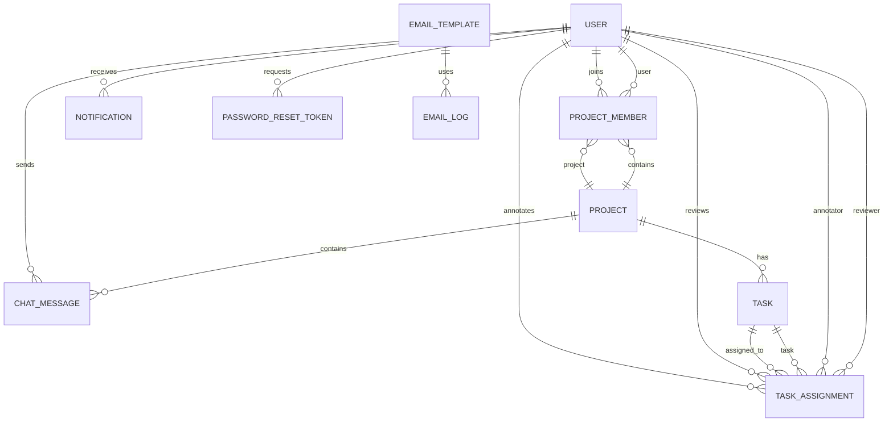

# Database Design Documentation

> Comprehensive guide to V-Label's PostgreSQL database architecture, design patterns, and implementation rationale

**Last Updated:** 2026-01-19  
**Database Version:** PostgreSQL 15/16  
**ORM:** Prisma 6.19  
**Schema Migrations:** 7 migrations applied

---

## Table of Contents

1. [Design Philosophy](#design-philosophy)
2. [Entity Relationship Diagram](#entity-relationship-diagram)
3. [Schema Overview](#schema-overview)
4. [Core Tables](#core-tables)
5. [Data Flow Patterns](#data-flow-patterns)
6. [Performance Optimizations](#performance-optimizations)
7. [Design Decisions & Rationale](#design-decisions--rationale)
8. [Migration History](#migration-history)

---

## Design Philosophy

### Core Principles

**1. Type Safety First**
- UUID primary keys for distributed system compatibility
- Enum types for strict value constraints
- JSONB for flexible, structured metadata

**2. Data Integrity**
- Foreign key constraints with CASCADE deletes
- NOT NULL constraints where business logic demands
- Unique constraints to prevent duplicates

**3. Audit Trail**
- `createdAt` and `updatedAt` timestamps on all core tables
- Dedicated `AuditLog` table for action tracking
- Email logs for communication history

**4. Scalability Ready**
- Indexed foreign keys for join performance
- Composite indexes for common query patterns
- JSONB for schema-less expansion

**5. Security by Design**
- Password hashes (never plain text)
- Token-based password resets with expiry
- Active/inactive user flags

---

## Entity Relationship Diagram

### High-Level Overview



### Detailed Relationship Breakdown

```
┌─────────────────────────────────────────────────────────────┐
│                      USER MANAGEMENT                        │
├─────────────────────────────────────────────────────────────┤
│  User                                                       │
│  ├─ 1:N → ProjectMember (joins projects)                   │
│  ├─ 1:N → TaskAssignment (as annotator)                    │
│  ├─ 1:N → TaskAssignment (as reviewer)                     │
│  ├─ 1:N → Notification (receives)                          │
│  ├─ 1:N → ChatMessage (sends)                              │
│  └─ 1:N → PasswordResetToken (requests)                    │
└─────────────────────────────────────────────────────────────┘

┌─────────────────────────────────────────────────────────────┐
│                    PROJECT WORKFLOW                         │
├─────────────────────────────────────────────────────────────┤
│  Project                                                    │
│  ├─ 1:N → ProjectMember (M:N with User via junction)       │
│  ├─ 1:N → Task (images to label)                           │
│  └─ 1:N → ChatMessage (project communication)              │
│                                                             │
│  Task                                                       │
│  ├─ N:1 → Project (belongs to)                             │
│  └─ 1:N → TaskAssignment (assigned to users)               │
│                                                             │
│  TaskAssignment                                             │
│  ├─ N:1 → Task (references)                                │
│  ├─ N:1 → User as annotator (assigned to)                  │
│  └─ N:1 → User as reviewer (optional, assigned after)      │
└─────────────────────────────────────────────────────────────┘

┌─────────────────────────────────────────────────────────────┐
│                  SUPPORT SYSTEMS                            │
├─────────────────────────────────────────────────────────────┤
│  - AuditLog (system actions tracking)                      │
│  - SystemConfig (key-value configuration)                  │
│  - EmailTemplate (notification templates)                  │
│  - EmailConfig (SMTP/provider settings)                    │
│  - EmailLog (email delivery tracking)                      │
└─────────────────────────────────────────────────────────────┘
```

---

## Schema Overview

### Database Statistics

| Aspect | Count |
|--------|-------|
| **Total Tables** | 14 |
| **Core Workflow Tables** | 5 (User, Project, Task, TaskAssignment, ProjectMember) |
| **Communication Tables** | 2 (Notification, ChatMessage) |
| **System Tables** | 3 (AuditLog, SystemConfig, PasswordResetToken) |
| **Email Service Tables** | 3 (EmailTemplate, EmailConfig, EmailLog) |
| **Enum Types** | 5 (UserRole, AuthProvider, ProjectStatus, TaskStatus, AssignmentStatus, NotificationType) |
| **Total Indexes** | 12+ (composite + single column) |

### Table Categories

#### 1. **User Management** (2 tables)
- `users` - User accounts, roles, reputation
- `password_reset_tokens` - Secure password recovery

#### 2. **Project Workflow** (4 tables)
- `projects` - Labeling projects
- `project_members` - Many-to-many junction table
- `tasks` - Individual images to annotate
- `task_assignments` - Assignment and annotation data

#### 3. **Communication** (2 tables)
- `notifications` - In-app notifications
- `chat_messages` - Project-based team chat

#### 4. **System & Audit** (2 tables)
- `audit_logs` - Action tracking
- `system_configs` - Key-value settings

#### 5. **Email Service** (3 tables)
- `email_templates` - HTML/text templates
- `email_configs` - SMTP provider configs
- `email_logs` - Delivery history

---

## Core Tables

### 1. Users Table

**Purpose:** Central user management with authentication, roles, and reputation tracking

**Design Rationale:**
- **UUID Primary Key**: Distributed-friendly, non-sequential for security
- **Multiple Auth Providers**: Support both email/password and OAuth (Google)
- **Reputation System**: Gamification to incentivize quality work
- **Nullable Password**: Google users don't need passwords

```sql
CREATE TABLE "users" (
    "id" UUID PRIMARY KEY DEFAULT uuid_generate_v4(),
    "email" VARCHAR(255) UNIQUE NOT NULL,
    "google_id" VARCHAR(255) UNIQUE,
    "password_hash" VARCHAR(255),  -- Nullable for OAuth users
    "provider" TEXT DEFAULT 'LOCAL',
    
    "full_name" VARCHAR(255),
    "avatar_url" VARCHAR(512),
    "phone_number" VARCHAR(20),
    
    "role" TEXT DEFAULT 'ANNOTATOR',
    "is_active" BOOLEAN DEFAULT false,
    
    -- Reputation System
    "reputation_score" DOUBLE PRECISION DEFAULT 0,
    "total_tasks_done" INTEGER DEFAULT 0,
    
    "created_at" TIMESTAMP DEFAULT NOW(),
    "updated_at" TIMESTAMP DEFAULT NOW()
);
```

**Example Data:**

| id | email | role | reputation_score | total_tasks_done |
|----|-------|------|------------------|------------------|
| `550e8400-e29b-41d4-a716-446655440000` | john@example.com | ANNOTATOR | 85.5 | 42 |
| `660e8400-e29b-41d4-a716-446655440001` | alice@example.com | REVIEWER | 95.2 | 120 |
| `770e8400-e29b-41d4-a716-446655440002` | admin@vlabel.com | ADMIN | 100.0 | 0 |

**Key Design Decisions:**

✅ **Why UUID?**
- Distributed system friendly (can generate IDs on client)
- Non-sequential prevents enumeration attacks
- No collision risk when scaling horizontally

✅ **Why Nullable Password?**
- Google OAuth users authenticate via tokens
- Forcing empty strings would be semantically incorrect
- `passwordHash IS NULL AND provider = 'GOOGLE'` is explicit

✅ **Why Reputation Score?**
- Incentivizes high-quality annotations
- Enables task routing to best performers
- Provides leaderboard and gamification

---

### 2. Projects Table

**Purpose:** Container for labeling campaigns with custom label configurations

**Design Rationale:**
- **JSONB Label Config**: Flexible schema for any label type (bbox, polygon, keypoint)
- **AI Assistance Flag**: Per-project control over AI features
- **Status Lifecycle**: Clear project states (DRAFT → ACTIVE → COMPLETED)

```sql
CREATE TABLE "projects" (
    "id" UUID PRIMARY KEY DEFAULT uuid_generate_v4(),
    "name" VARCHAR(255) NOT NULL,
    "description" TEXT,
    
    -- Flexible label schema
    "label_config" JSONB DEFAULT '[]',
    
    "deadline" TIMESTAMP,
    "enable_ai_assistance" BOOLEAN DEFAULT false,
    "status" TEXT DEFAULT 'ACTIVE',
    
    "created_at" TIMESTAMP DEFAULT NOW(),
    "updated_at" TIMESTAMP DEFAULT NOW()
);
```

**Example Label Configuration (JSONB):**

```json
{
  "label_config": [
    {
      "id": "person",
      "name": "Person",
      "color": "#FF6B6B",
      "type": "bbox",
      "hotkey": "1"
    },
    {
      "id": "car",
      "name": "Car",
      "color": "#4ECDC4",
      "type": "bbox",
      "hotkey": "2"
    },
    {
      "id": "bicycle",
      "name": "Bicycle",
      "color": "#45B7D1",
      "type": "polygon",
      "hotkey": "3"
    }
  ]
}
```

**Project Status Lifecycle:**

```
DRAFT ────> ACTIVE ────> PAUSED ────> COMPLETED ────> ARCHIVED
  ↓            ↓            ↓             ↑              ↑
  └────────────┴────────────┴─────────────┘              │
                                                         │
                  Manual Archive ─────────────────────────┘
```

**Key Design Decisions:**

✅ **Why JSONB for Labels?**
- Schema varies per project (object detection vs segmentation)
- Avoid EAV anti-pattern (Entity-Attribute-Value tables)
- PostgreSQL JSONB is indexed and queryable
- Eliminates need for complex joins

✅ **Why Per-Project AI Flag?**
- Some projects need human-only labels (benchmarks)
- Others benefit from AI pre-annotation (large datasets)
- Centralized control at project level

---

### 3. Tasks Table

**Purpose:** Individual images to be annotated

**Design Rationale:**
- **Lightweight**: Only stores image_url and status
- **Cascade Delete**: Deleting project removes all tasks
- **One Task → Many Assignments**: Same image can be annotated by multiple users for consensus

```sql
CREATE TABLE "tasks" (
    "id" UUID PRIMARY KEY DEFAULT uuid_generate_v4(),
    "project_id" UUID NOT NULL REFERENCES "projects"(id) ON DELETE CASCADE,
    "image_url" TEXT NOT NULL,
    "status" TEXT DEFAULT 'TODO',
    
    FOREIGN KEY ("project_id") REFERENCES "projects"("id") ON DELETE CASCADE
);

CREATE INDEX "idx_tasks_project_id" ON "tasks"("project_id");
CREATE INDEX "idx_tasks_status" ON "tasks"("status");
```

**Task Status Flow:**

```
TODO ──────> IN_PROGRESS ──────> DONE
  ↑               ↓                 ↓
  └───────────────┘   (reassign)   └──> (exported)
```

**Key Design Decisions:**

✅ **Why Separate Tasks from Assignments?**
- Same image can have multiple assignments (consensus labeling)
- Task status aggregates from all assignments
- Enables rework without duplicating image URLs

---

### 4. TaskAssignment Table

**Purpose:** Links users to tasks with annotation data and review workflow

**Design Rationale:**
- **Dual User References**: Annotator (required) + Reviewer (optional later)
- **JSONB Annotations**: Flexible storage for any annotation type
- **Review Scoring**: 1-10 scale for quality tracking
- **Status Machine**: Clear workflow states

```sql
CREATE TABLE "task_assignments" (
    "id" UUID PRIMARY KEY DEFAULT uuid_generate_v4(),
    "task_id" UUID NOT NULL REFERENCES "tasks"(id) ON DELETE CASCADE,
    
    -- Worker and Reviewer
    "annotator_id" UUID NOT NULL REFERENCES "users"(id),
    "reviewer_id" UUID REFERENCES "users"(id),  -- Nullable initially
    
    "status" TEXT DEFAULT 'ASSIGNED',
    "deadline" TIMESTAMP,
    
    -- Annotation Data
    "annotations" JSONB,  -- Stores bboxes, polygons, etc.
    "is_ai_generated" BOOLEAN DEFAULT false,
    
    -- Feedback Loop
    "annotator_note" TEXT,
    "review_score" INTEGER CHECK ("review_score" BETWEEN 1 AND 10),
    "review_comment" TEXT,
    
    "created_at" TIMESTAMP DEFAULT NOW(),
    "updated_at" TIMESTAMP DEFAULT NOW()
);
```

**Example Annotation Data (JSONB):**

```json
{
  "annotations": {
    "objects": [
      {
        "id": "obj_1",
        "label": "person",
        "type": "bbox",
        "coordinates": {
          "x": 100,
          "y": 150,
          "width": 200,
          "height": 300
        },
        "confidence": 0.95,  // If AI-generated
        "is_ai_suggested": true
      },
      {
        "id": "obj_2",
        "label": "car",
        "type": "polygon",
        "points": [
          {"x": 50, "y": 50},
          {"x": 150, "y": 50},
          {"x": 150, "y": 150},
          {"x": 50, "y": 150}
        ],
        "is_ai_suggested": false
      }
    ],
    "metadata": {
      "annotator_time_spent_seconds": 120,
      "tool_used": "konva_v1.0"
    }
  }
}
```

**Assignment Status Workflow:**

```
ASSIGNED ──> IN_PROGRESS ──> SUBMITTED
                               │
                               ├─> APPROVED ──> (reputation +)
                               │
                               ├─> REJECTED ──> IN_PROGRESS (rework)
                               │
                               └─> SKIPPED (no reputation change)
```

**Key Design Decisions:**

✅ **Why Separate Annotator and Reviewer Fields?**
- Different users, different permissions
- Reviewer assigned after submission
- Prevents self-review (add constraint later)

✅ **Why JSONB for Annotations?**
- Annotation types vary (bbox, polygon, keypoint, segmentation)
- Adding new annotation types doesn't require migrations
- Full-text search capabilities if needed

✅ **Why Review Score (1-10)?**
- More granular than binary approve/reject
- Enables reputation calculation: `reputation += (score - 5) * 2`
- Identifies high/low quality work

---

### 5. ProjectMember (Junction Table)

**Purpose:** Many-to-many relationship between users and projects

**Design Rationale:**
- **Composite Unique Constraint**: One user can't join same project twice
- **Cascade Delete**: Removing project/user removes memberships
- **Join Date Tracking**: Audit when users joined

```sql
CREATE TABLE "project_members" (
    "id" UUID PRIMARY KEY DEFAULT uuid_generate_v4(),
    "project_id" UUID NOT NULL REFERENCES "projects"(id) ON DELETE CASCADE,
    "user_id" UUID NOT NULL REFERENCES "users"(id) ON DELETE CASCADE,
    "joined_at" TIMESTAMP DEFAULT NOW(),
    
    UNIQUE("project_id", "user_id")
);

CREATE INDEX "idx_project_members_project_id" ON "project_members"("project_id");
CREATE INDEX "idx_project_members_user_id" ON "project_members"("user_id");
```

**Query Example:**

```sql
-- Get all projects for a user
SELECT p.* FROM projects p
INNER JOIN project_members pm ON p.id = pm.project_id
WHERE pm.user_id = '550e8400-e29b-41d4-a716-446655440000';

-- Get all members of a project
SELECT u.* FROM users u
INNER JOIN project_members pm ON u.id = pm.user_id
WHERE pm.project_id = '660e8400-e29b-41d4-a716-446655440001';
```

---

### 6. Notifications Table

**Purpose:** In-app notification system

**Design Rationale:**
- **Type Enum**: Predefined notification categories
- **JSONB Metadata**: Store contextual data (task_id, project_name, etc.)
- **Composite Index**: Fast queries for unread notifications per user

```sql
CREATE TABLE "notifications" (
    "id" UUID PRIMARY KEY DEFAULT uuid_generate_v4(),
    "user_id" UUID NOT NULL REFERENCES "users"(id) ON DELETE CASCADE,
    "type" TEXT NOT NULL,
    "title" VARCHAR(255) NOT NULL,
    "message" TEXT NOT NULL,
    "metadata" JSONB,
    "is_read" BOOLEAN DEFAULT false,
    "created_at" TIMESTAMP DEFAULT NOW()
);

CREATE INDEX "idx_notifications_user_read" ON "notifications"("user_id", "is_read");
```

**Notification Types:**

| Type | Trigger | Example |
|------|---------|---------|
| `TASK_ASSIGNED` | Manager assigns task | "You have been assigned 5 new tasks" |
| `TASK_SUBMITTED` | Annotator submits | "Task #123 submitted for review" (to reviewer) |
| `TASK_APPROVED` | Reviewer approves | "Your task #123 was approved (+2 reputation)" |
| `TASK_REJECTED` | Reviewer rejects | "Task #123 needs rework (see feedback)" |
| `DEADLINE_WARNING` | Cron job | "Task #123 due in 2 hours" |
| `COMMENT_MENTION` | User @mentions | "@john mentioned you in project chat" |

**Example Metadata:**

```json
{
  "metadata": {
    "task_id": "abc-123",
    "project_id": "def-456",
    "project_name": "Street Scene Annotation",
    "reviewer_name": "Alice Smith",
    "review_score": 8,
    "link_url": "/tasks/abc-123"
  }
}
```

---

### 7. ChatMessage Table

**Purpose:** Project-based team communication

**Design Rationale:**
- **Project Scoped**: Messages belong to specific projects
- **Composite Index**: Fast message retrieval sorted by time
- **Cascade Delete**: Deleting project removes all messages

```sql
CREATE TABLE "chat_messages" (
    "id" UUID PRIMARY KEY DEFAULT uuid_generate_v4(),
    "project_id" UUID NOT NULL REFERENCES "projects"(id) ON DELETE CASCADE,
    "sender_id" UUID NOT NULL REFERENCES "users"(id) ON DELETE CASCADE,
    "content" TEXT NOT NULL,
    "created_at" TIMESTAMP DEFAULT NOW()
);

CREATE INDEX "idx_chat_project_time" ON "chat_messages"("project_id", "created_at");
```

**Key Design Decisions:**

✅ **Why Project-Scoped?**
- Communication context is project-specific
- Easy to implement project-wise chat rooms
- Can add DM later with nullable project_id

---

### 8. AuditLog Table

**Purpose:** Track all significant system actions

**Design Rationale:**
- **Actor Tracking**: Who performed the action
- **Target Tracking**: What/who was affected (optional)
- **JSONB Metadata**: Flexible action details

```sql
CREATE TABLE "audit_logs" (
    "id" UUID PRIMARY KEY DEFAULT uuid_generate_v4(),
    "action" VARCHAR(255) NOT NULL,
    "actor_id" UUID NOT NULL,
    "target_id" UUID,
    "metadata" JSONB,
    "created_at" TIMESTAMP DEFAULT NOW()
);

CREATE INDEX "idx_audit_actor" ON "audit_logs"("actor_id");
CREATE INDEX "idx_audit_created" ON "audit_logs"("created_at");
```

**Example Log Entries:**

| action | actor_id | target_id | metadata |
|--------|----------|-----------|----------|
| `USER_LOGIN` | user_123 | NULL | `{"ip": "192.168.1.1", "user_agent": "..."}` |
| `TASK_APPROVED` | reviewer_456 | task_789 | `{"review_score": 9, "assignment_id": "..."}` |
| `PROJECT_CREATED` | manager_321 | project_111 | `{"project_name": "Traffic Detection"}` |
| `USER_DELETED` | admin_001 | user_999 | `{"reason": "duplicate account"}` |

---

### 9-11. Email Service Tables

**Purpose:** Email template management, configuration, and logging

#### EmailTemplate

```sql
CREATE TABLE "email_templates" (
    "id" UUID PRIMARY KEY,
    "type" VARCHAR(100) UNIQUE NOT NULL,  -- e.g. 'password_reset', 'task_assigned'
    "subject" VARCHAR(255) NOT NULL,
    "html_body" TEXT NOT NULL,
    "text_body" TEXT,
    "variables" JSONB,  -- ["user_name", "reset_link", "expires_at"]
    "enabled" BOOLEAN DEFAULT true,
    "created_at" TIMESTAMP DEFAULT NOW(),
    "updated_at" TIMESTAMP DEFAULT NOW()
);
```

#### EmailConfig

```sql
CREATE TABLE "email_configs" (
    "id" UUID PRIMARY KEY,
    "key" VARCHAR(100) UNIQUE NOT NULL,
    "provider" VARCHAR(50) NOT NULL,  -- 'smtp', 'sendgrid', 'aws_ses'
    "config" JSONB NOT NULL,  -- Provider-specific settings
    "is_active" BOOLEAN DEFAULT false,
    "created_at" TIMESTAMP DEFAULT NOW(),
    "updated_at" TIMESTAMP DEFAULT NOW()
);
```

#### EmailLog

```sql
CREATE TABLE "email_logs" (
    "id" UUID PRIMARY KEY,
    "to" VARCHAR(255) NOT NULL,
    "from" VARCHAR(255) NOT NULL,
    "subject" VARCHAR(255) NOT NULL,
    "template_type" VARCHAR(100),
    "status" VARCHAR(50) NOT NULL,  -- 'sent', 'failed', 'pending'
    "error" TEXT,
    "sent_at" TIMESTAMP,
    "created_at" TIMESTAMP DEFAULT NOW()
);

CREATE INDEX "idx_email_log_to" ON "email_logs"("to");
CREATE INDEX "idx_email_log_status" ON "email_logs"("status");
```

---

## Data Flow Patterns

### Pattern 1: User Registration → Email Verification

```
┌─────────────────────────────────────────────────────────────┐
│  1. User Registration Flow                                  │
└─────────────────────────────────────────────────────────────┘

POST /api/v1/auth/register
  ↓
INSERT INTO users (email, password_hash, is_active=false)
  ↓
Generate verification token
  ↓
INSERT INTO password_reset_tokens (token, user_id, expires_at)
  ↓
Fetch email template (type='email_verification')
  ↓
Replace variables ({{user_name}}, {{verification_link}})
  ↓
Send email via configured provider (SMTP/SendGrid)
  ↓
INSERT INTO email_logs (to, template_type, status='sent')
```

### Pattern 2: Task Assignment → Annotation → Review → Reputation Update

```
┌─────────────────────────────────────────────────────────────┐
│  2. Complete Annotation Workflow                            │
└─────────────────────────────────────────────────────────────┘

Manager creates task:
  INSERT INTO tasks (project_id, image_url, status='TODO')
    ↓
Manager assigns to annotator:
  INSERT INTO task_assignments 
    (task_id, annotator_id, status='ASSIGNED')
  UPDATE tasks SET status='IN_PROGRESS'
  INSERT INTO notifications 
    (user_id=annotator_id, type='TASK_ASSIGNED')
    ↓
Annotator works on task:
  UPDATE task_assignments 
    SET annotations='...', status='IN_PROGRESS'
    ↓
Annotator submits:
  UPDATE task_assignments SET status='SUBMITTED'
  UPDATE task_assignments SET reviewer_id=<auto_assigned>
  INSERT INTO notifications 
    (user_id=reviewer_id, type='TASK_SUBMITTED')
    ↓
Reviewer inspects and approves:
  UPDATE task_assignments 
    SET status='APPROVED', review_score=9, review_comment='...'
  UPDATE users 
    SET reputation_score += 2, total_tasks_done += 1
    WHERE id=annotator_id
  UPDATE tasks SET status='DONE'
  INSERT INTO notifications 
    (user_id=annotator_id, type='TASK_APPROVED')
  INSERT INTO audit_logs 
    (action='TASK_APPROVED', actor_id=reviewer_id, target_id=task_id)
```

### Pattern 3: Password Reset Flow

```
┌─────────────────────────────────────────────────────────────┐
│  3. Secure Password Reset                                   │
└─────────────────────────────────────────────────────────────┘

User requests reset:
  POST /api/v1/auth/forgot-password
    ↓
Verify user exists:
  SELECT id FROM users WHERE email=?
    ↓
Generate secure token (crypto.randomBytes):
  token = generateSecureToken(32)
    ↓
Store with expiry:
  INSERT INTO password_reset_tokens 
    (user_id, token, expires_at=NOW() + INTERVAL '1 hour')
    ↓
Send email:
  Fetch template (type='password_reset')
  Send email with reset link
  INSERT INTO email_logs (...)
    ↓
User clicks link with token:
  GET /reset-password?token=xyz
    ↓
Validate token:
  SELECT * FROM password_reset_tokens 
  WHERE token=? AND used=false AND expires_at > NOW()
    ↓
User submits new password:
  UPDATE users SET password_hash=?
  UPDATE password_reset_tokens SET used=true
  INSERT INTO audit_logs (action='PASSWORD_RESET', actor_id=user_id)
```

---

## Performance Optimizations

### Indexes Strategy

#### Primary Indexes (Automatic)

```sql
-- All primary keys automatically indexed
CREATE UNIQUE INDEX users_pkey ON users(id);
CREATE UNIQUE INDEX projects_pkey ON projects(id);
-- ... etc
```

#### Foreign Key Indexes

```sql
-- Speed up JOIN queries
CREATE INDEX idx_tasks_project_id ON tasks(project_id);
CREATE INDEX idx_task_assignments_task_id ON task_assignments(task_id);
CREATE INDEX idx_task_assignments_annotator_id ON task_assignments(annotator_id);
CREATE INDEX idx_task_assignments_reviewer_id ON task_assignments(reviewer_id);
CREATE INDEX idx_project_members_project_id ON project_members(project_id);
CREATE INDEX idx_project_members_user_id ON  project_members(user_id);
```

#### Composite Indexes (Query Optimization)

```sql
-- Unread notifications per user (most common query)
CREATE INDEX idx_notifications_user_read 
  ON notifications(user_id, is_read);

-- Project chat sorted by time
CREATE INDEX idx_chat_project_time 
  ON chat_messages(project_id, created_at);

-- Email log search by recipient
CREATE INDEX idx_email_log_to ON email_logs(to);
CREATE INDEX idx_email_log_status ON email_logs(status);
CREATE INDEX idx_email_log_created ON email_logs(created_at);
```

### Query Performance Examples

**Before Index:**

```sql
-- Full table scan on 1M notifications
SELECT * FROM notifications 
WHERE user_id = '...' AND is_read = false;

-- Execution time: ~500ms
```

**After Composite Index:**

```sql
-- Index-only scan
EXPLAIN ANALYZE
SELECT * FROM notifications 
WHERE user_id = '...' AND is_read = false;

-- Execution time: ~5ms (100x faster)
-- Index Scan using idx_notifications_user_read
```

### JSONB Performance

```sql
-- JSONB queries are surprisingly fast
SELECT * FROM projects 
WHERE label_config @> '[{"id": "person"}]';

-- Can add GIN index if needed:
CREATE INDEX idx_projects_label_config 
  ON projects USING GIN (label_config);
```

---

## Design Decisions & Rationale

### 1. Why UUID over Auto-Increment?

**Decision:** Use `UUID` for all primary keys

**Rationale:**

✅ **Distributed System Ready**
- Can generate IDs on client-side without DB round-trip
- No conflicts when merging databases
- Enables offline-first features

✅ **Security**
- Non-sequential prevents enumeration attacks
- Harder to guess valid IDs (`/tasks/1`, `/tasks/2` → leak count)

✅ **Microservices Compatible**
- Each service can generate IDs independently
- No need for centralized ID generator

❌ **Trade-offs:**
- Larger index size (16 bytes vs 4 bytes for INT)
- Slightly slower joins (but negligible with proper indexes)
- UUIDs are not human-readable

**Mitigation:** Use BIGINT for high-frequency append-only tables (future logs)

---

### 2. Why JSONB over Normalized Tables?

**Decision:** Use JSONB for `label_config`, `annotations`, `metadata`

**Rationale:**

✅ **Schema Flexibility**
- Different projects have different label structures
- Avoid EAV anti-pattern (Entity-Attribute-Value hell)
- Annotations vary by type (bbox, polygon, keypoint)

✅ **PostgreSQL JSONB Benefits**
- Binary format (fast querying)
- GIN indexing support
- Validation with constraints possible

✅ **Developer Experience**
- TypeScript interfaces map directly to JSON
- No ORM impedance mismatch
- Easy to add new fields without migrations

❌ **Trade-offs:**
- Cannot enforce schema at DB level
- Joins on JSONB fields are inefficient
- Storage overhead for repeated keys

**Mitigation:**
- Validate JSON structure in application layer (Zod schemas)
- Use normalized tables for frequently-queried fields
- Document expected JSON structure in comments

---

### 3. Why Separate Task from TaskAssignment?

**Decision:** Two tables instead of one

**Rationale:**

✅ **Multiple Assignments Per Task**
- Consensus labeling: 3 annotators label same image
- Quality check: Compare annotations across users
- Rework: Same task assigned again after rejection

✅ **Clear Separation of Concerns**
- Task = Image metadata (immutable)
- Assignment = Work assignment (mutable)
- Easier to track assignment history

✅ **Performance**
- Task table remains small
- Assignment table can be partitioned by date

**Example Scenario:**

```
Task #1 (image: cat.jpg)
  ├─ Assignment #1: Annotator A (score: 8/10, approved)
  ├─ Assignment #2: Annotator B (score: 9/10, approved)
  └─ Assignment #3: Annotator C (score: 6/10, rejected → reassigned)
        └─ Assignment #4: Annotator C (rework, score: 9/10, approved)
```

---

### 4. Why Nullable Reviewer in TaskAssignment?

**Decision:** `reviewer_id UUID?` (nullable)

**Rationale:**

✅ **Workflow Progression**
- Reviewer assigned AFTER annotator submits
- Cannot know reviewer at task creation time
- Allows auto-assignment algorithms

✅ **Flexibility**
- Some projects may skip review (trusted annotators)
- Admin can manually override reviewer assignments

❌ **Trade-off:** Complicates queries (need `LEFT JOIN`)

**Alternative Considered:** Separate `Review` table
- Rejected: Over-normalization for simple use case
- Current design keeps review data with assignment

---

### 5. Why Cascade Deletes?

**Decision:** `ON DELETE CASCADE` for most foreign keys

**Rationale:**

✅ **Data Consistency**
- Deleting project removes all related tasks, assignments, members
- No orphaned records
- Simplified cleanup logic

✅ **User Expectations**
- "Delete project" should delete everything related
- Avoids partial delete bugs

❌ **Risk:** Accidental mass deletion

**Mitigation:**
- Soft deletes for critical tables (add `deleted_at`)
- Require confirmation dialogs in UI
- Audit log tracks all deletions
- Database backups (point-in-time recovery)

**Example:**

```sql
-- Deleting a project cascades to:
DELETE FROM projects WHERE id = '...';
  ↓ CASCADE DELETE
  ├─ project_members (all memberships)
  ├─ tasks (all images)
  │   └─ task_assignments (all annotations)
  └─ chat_messages (all chat history)
```

---

### 6. Why Reputation Score as Float?

**Decision:** `reputationScore DOUBLE PRECISION`

**Rationale:**

✅ **Gradual Changes**
- Score changes based on review quality (+2 for score 9/10, -3 for score 3/10)
- Averaging over time produces decimals
- More nuanced than integer buckets

✅ **Algorithm Flexibility**
- Can implement ELO-like rating system
- Weighted averages (recent tasks count more)

**Example Calculation:**

```typescript
// Review score: 1-10
// Reputation change: (score - 5) * 2
const change = (reviewScore - 5) * 2;
newReputation = oldReputation + change;

// Examples:
// score=10 → +10 points
// score=8  → +6 points
// score=5  → 0 points (neutral)
// score=3  → -4 points
```

---

### 7. Why Email Service Tables?

**Decision:** Dedicated tables for email infrastructure

**Rationale:**

✅ **Decoupling**
- Email logic separate from business logic
- Can switch providers (SMTP → SendGrid) without code changes
- Templates managed by admins, not developers

✅ **Auditability**
- Know exactly what emails were sent
- Debug delivery issues
- Compliance (GDPR email logs)

✅ **Cost Tracking**
- Monitor email volume
- Detect spam/abuse
- Rate limiting per user

---

## Migration History

### Migration Timeline

| Date | Migration | Description |
|------|-----------|-------------|
| 2026-01-14 | `init_vlabel_schema` | Initial schema with Users, Projects, Tasks, Assignments |
| 2026-01-17 | `add_google_id_fix` | Added Google OAuth support (google_id column) |
| 2026-01-17 | `update_user_defaults` | Changed user defaults (is_active=false) |
| 2026-01-18 | `add_websocket_tables` | Added Notifications and ChatMessages |
| 2026-01-18 | `add_audit_log` | Added AuditLog for action tracking |
| 2026-01-18 | `add_system_config` | Added SystemConfig key-value store |
| 2026-01-18 | `add_password_reset_and_email_service` | Password reset + Email tables |

### How to Apply Migrations

```bash
# Generate Prisma Client
cd server
npx prisma generate

# Apply pending migrations
npx prisma migrate deploy

# Development: Create new migration
npx prisma migrate dev --name add_feature_x

# Reset database (DANGER: deletes all data)
npx prisma migrate reset
```

### Rollback Strategy

```bash
# Manual rollback (no built-in rollback in Prisma)
# 1. Restore database from backup
pg_restore -d vlabel_db backup.sql

# 2. OR manually write DOWN migration
# Example: Undo 'add_websocket_tables'
DROP TABLE notifications;
DROP TABLE chat_messages;
DROP TYPE notification_type;
```

---

## Summary

### Key Strengths of This Design

1. ✅ **Type-Safe**: UUIDs, enums, constraints enforce data integrity
2. ✅ **Flexible**: JSONB allows schema evolution without migrations
3. ✅ **Scalable**: Indexed foreign keys, composite indexes, JSONB GIN
4. ✅ **Auditable**: Timestamps, audit logs, email logs
5. ✅ **Secure**: Password hashing, token expiry, cascade deletes
6. ✅ **Developer-Friendly**: Prisma ORM, clear relationships, meaningful names

### Future Improvements

- **Partitioning**: Partition `email_logs` and `audit_logs` by date
- **Soft Deletes**: Add `deleted_at` to critical tables
- **Full-Text Search**: GIN indexes on text columns
- **Read Replicas**: Split read/write workloads
- **Caching Layer**: Redis for hot data (user sessions, notifications)

---

**Maintained by:** V-Label Development Team  
**For questions:** See `docs/07_dev_guide.md` or contact tech lead
