# Data Flow Documentation - V-Label System

**Version**: 1.0  
**Last Updated**: 2026-01-24  
**Author**: V-Label Development Team

---

## 📋 Mục Lục

1. [Tổng Quan](#tổng-quan)
2. [Luồng Chính - End-to-End](#luồng-chính---end-to-end)
3. [Chi Tiết Từng Bước](#chi-tiết-từng-bước)
4. [Sơ Đồ Quan Hệ Database](#sơ-đồ-quan-hệ-database)
5. [Auto-Assignment Flow](#auto-assignment-flow)
6. [Quality Control Flow](#quality-control-flow)
7. [Ví Dụ Thực Tế](#ví-dụ-thực-tế)

---

## Tổng Quan

Tài liệu này mô tả chi tiết cách dữ liệu di chuyển qua hệ thống V-Label, từ khi Manager tạo project cho đến khi export ML dataset.

### Các Actor Chính

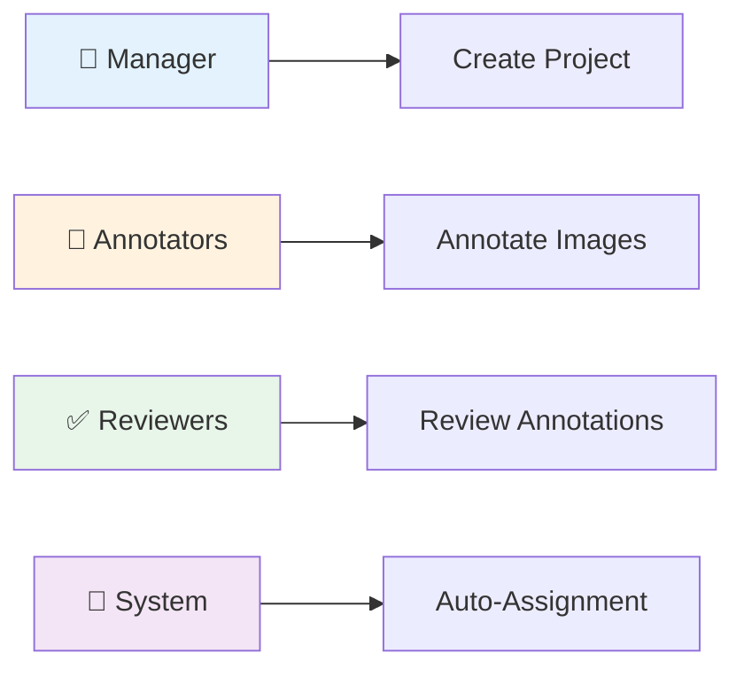
```mermaid
graph LR
    A[👤 Manager] --> B[Create Project]
    C[👥 Annotators] --> D[Annotate Images]
    E[✅ Reviewers] --> F[Review Annotations]
    G[🤖 System] --> H[Auto-Assignment]
    
    style A fill:#e3f2fd
    style C fill:#fff3e0
    style E fill:#e8f5e9
    style G fill:#f3e5f5
```

### Thống Kê Luồng

| Metric | Value |
|--------|-------|
| **Tổng số bước** | 9 bước |
| **Tables liên quan** | 12 tables |
| **Thời gian ước tính** | 5-6 ngày |
| **Database records** | ~26 records/project |

---

## Luồng Chính - End-to-End

### Sơ Đồ Tổng Quan

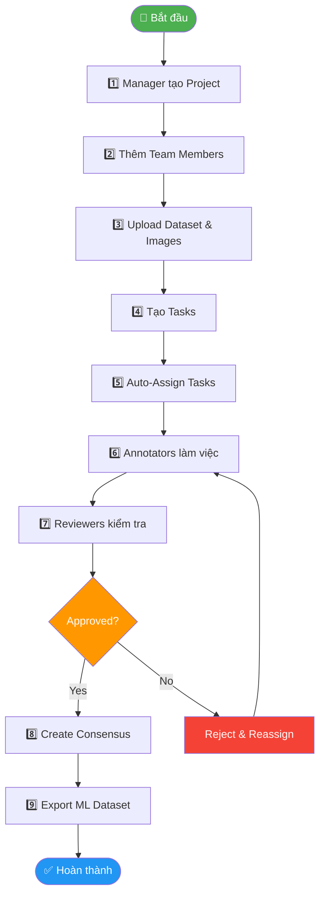
```mermaid
graph TD
    Start([🚀 Bắt đầu]) --> Step1[1️⃣ Manager tạo Project]
    Step1 --> Step2[2️⃣ Thêm Team Members]
    Step2 --> Step3[3️⃣ Upload Dataset & Images]
    Step3 --> Step4[4️⃣ Tạo Tasks]
    Step4 --> Step5[5️⃣ Auto-Assign Tasks]
    Step5 --> Step6[6️⃣ Annotators làm việc]
    Step6 --> Step7[7️⃣ Reviewers kiểm tra]
    Step7 --> Decision{Approved?}
    Decision -->|Yes| Step8[8️⃣ Create Consensus]
    Decision -->|No| Reject[Reject & Reassign]
    Reject --> Step6
    Step8 --> Step9[9️⃣ Export ML Dataset]
    Step9 --> End([✅ Hoàn thành])
    
    style Start fill:#4caf50,color:#fff
    style End fill:#2196f3,color:#fff
    style Decision fill:#ff9800,color:#fff
    style Reject fill:#f44336,color:#fff
```

### Timeline Ước Tính

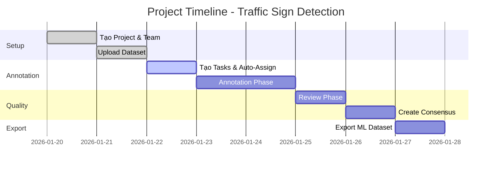
```mermaid
gantt
    title Project Timeline - Traffic Sign Detection
    dateFormat  YYYY-MM-DD
    section Setup
    Tạo Project & Team        :done, setup1, 2026-01-20, 1d
    Upload Dataset            :done, setup2, 2026-01-21, 1d
    section Annotation
    Tạo Tasks & Auto-Assign   :active, anno1, 2026-01-22, 1d
    Annotation Phase          :anno2, 2026-01-23, 2d
    section Quality
    Review Phase              :review, 2026-01-25, 1d
    Create Consensus          :consensus, 2026-01-26, 1d
    section Export
    Export ML Dataset         :export, 2026-01-27, 1d
```

---

## Chi Tiết Từng Bước

### Bước 1: Tạo Project 📁

**Actor**: Manager  
**Table**: `projects`

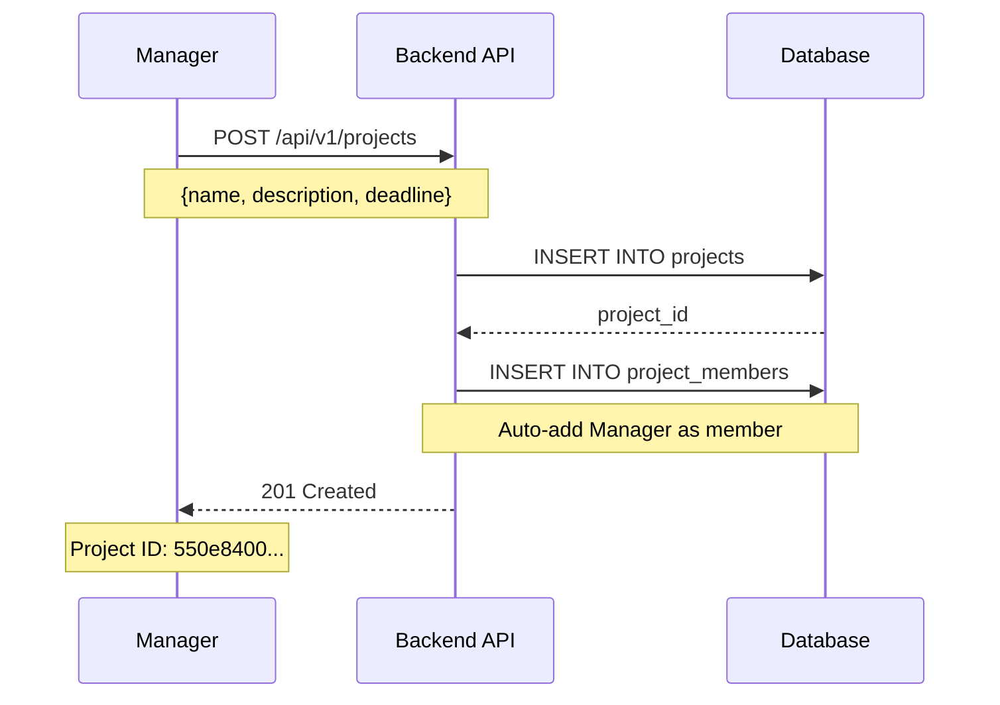
```mermaid
sequenceDiagram
    participant M as Manager
    participant API as Backend API
    participant DB as Database
    
    M->>API: POST /api/v1/projects
    Note over M,API: {name, description, deadline}
    API->>DB: INSERT INTO projects
    DB-->>API: project_id
    API->>DB: INSERT INTO project_members
    Note over API,DB: Auto-add Manager as member
    API-->>M: 201 Created
    Note over M: Project ID: 550e8400...
```

**Database Changes**:
```sql
-- 1 record in projects
-- 1 record in project_members (Manager)
```

---

### Bước 2: Thêm Team Members 👥

**Actor**: Manager  
**Table**: `project_members`

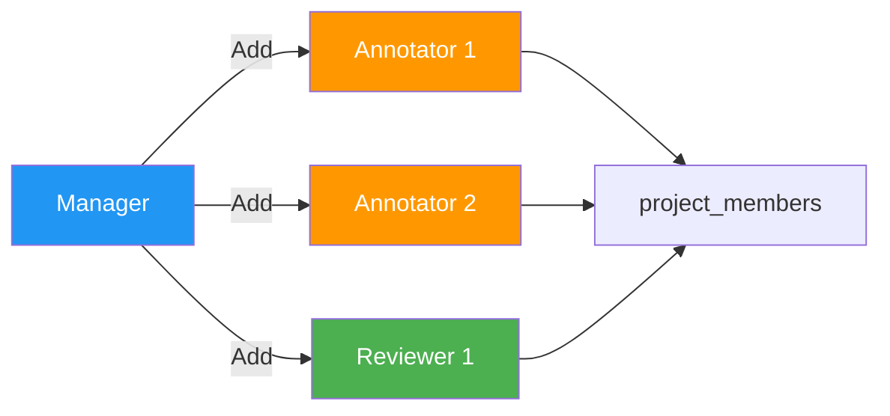
```mermaid
graph LR
    A[Manager] -->|Add| B[Annotator 1]
    A -->|Add| C[Annotator 2]
    A -->|Add| D[Reviewer 1]
    
    B --> E[project_members]
    C --> E
    D --> E
    
    style A fill:#2196f3,color:#fff
    style B fill:#ff9800,color:#fff
    style C fill:#ff9800,color:#fff
    style D fill:#4caf50,color:#fff
```

**Database Changes**:
```sql
-- 3 new records in project_members
-- Total: 4 members (1 Manager + 2 Annotators + 1 Reviewer)
```

---

### Bước 3: Upload Dataset 📤

**Actor**: Manager  
**Tables**: `datasets` → `images`

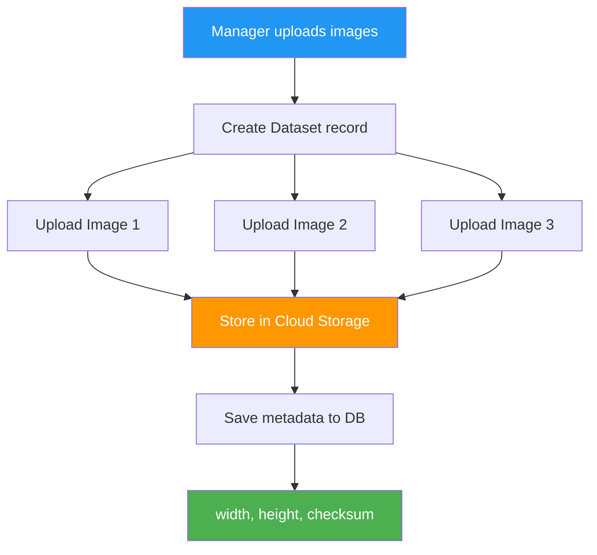
```mermaid
graph TD
    A[Manager uploads images] --> B[Create Dataset record]
    B --> C[Upload Image 1]
    B --> D[Upload Image 2]
    B --> E[Upload Image 3]
    
    C --> F[Store in Cloud Storage]
    D --> F
    E --> F
    
    F --> G[Save metadata to DB]
    G --> H[width, height, checksum]
    
    style A fill:#2196f3,color:#fff
    style F fill:#ff9800,color:#fff
    style H fill:#4caf50,color:#fff
```

**Image Metadata (CRITICAL for ML)**:
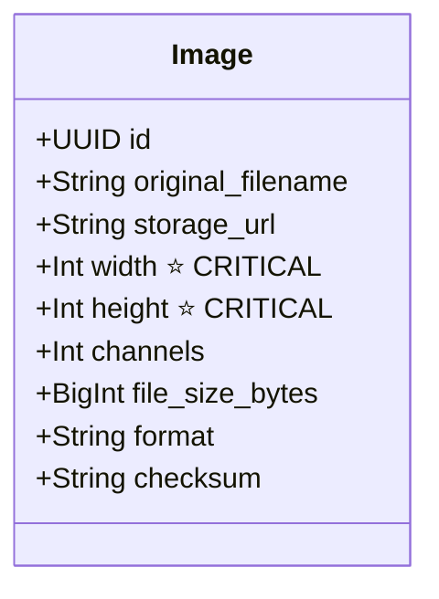
```mermaid
classDiagram
    class Image {
        +UUID id
        +String original_filename
        +String storage_url
        +Int width ⭐ CRITICAL
        +Int height ⭐ CRITICAL
        +Int channels
        +BigInt file_size_bytes
        +String format
        +String checksum
    }
```

**Database Changes**:
```sql
-- 1 record in datasets
-- 3 records in images
```

---

### Bước 4: Tạo Tasks 📋

**Actor**: Manager/System  
**Table**: `tasks`

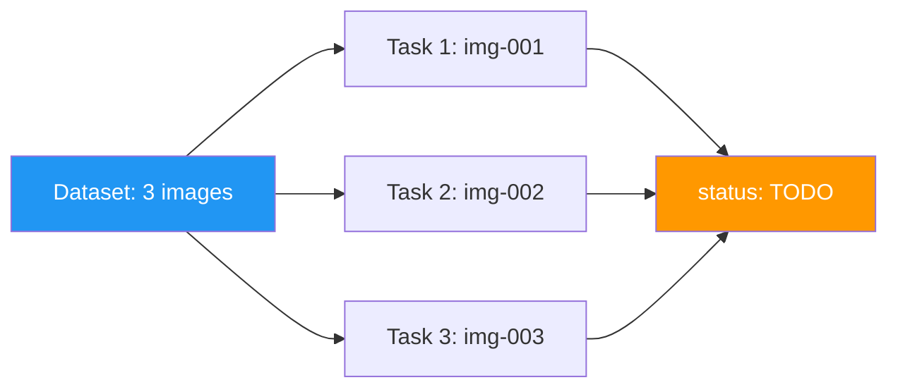
```mermaid
graph LR
    A[Dataset: 3 images] --> B[Task 1: img-001]
    A --> C[Task 2: img-002]
    A --> D[Task 3: img-003]
    
    B --> E[status: TODO]
    C --> E
    D --> E
    
    style A fill:#2196f3,color:#fff
    style E fill:#ff9800,color:#fff
```

**Database Changes**:
```sql
-- 3 records in tasks
-- Each task links to 1 image
```

---

### Bước 5: Auto-Assignment 🤖

**Tables**: `assignment_rules` → `user_workload` → `task_assignments`

#### 5.1. Assignment Rule Configuration

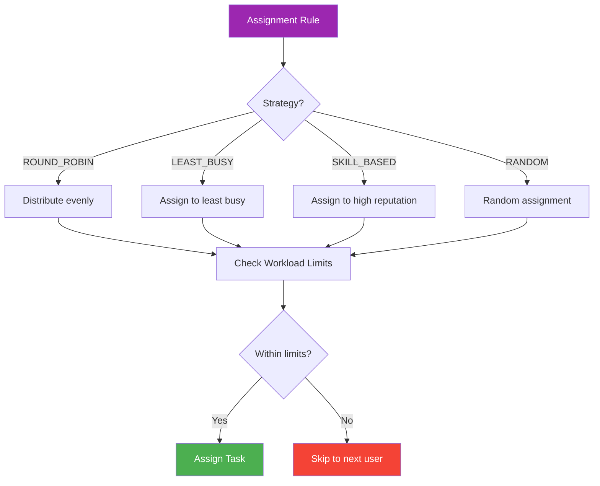
```mermaid
graph TD
    A[Assignment Rule] --> B{Strategy?}
    B -->|ROUND_ROBIN| C[Distribute evenly]
    B -->|LEAST_BUSY| D[Assign to least busy]
    B -->|SKILL_BASED| E[Assign to high reputation]
    B -->|RANDOM| F[Random assignment]
    
    C --> G[Check Workload Limits]
    D --> G
    E --> G
    F --> G
    
    G --> H{Within limits?}
    H -->|Yes| I[Assign Task]
    H -->|No| J[Skip to next user]
    
    style A fill:#9c27b0,color:#fff
    style I fill:#4caf50,color:#fff
    style J fill:#f44336,color:#fff
```

#### 5.2. Round Robin Example

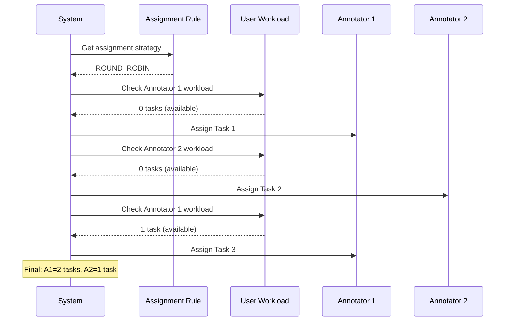
```mermaid
sequenceDiagram
    participant S as System
    participant R as Assignment Rule
    participant W as User Workload
    participant A1 as Annotator 1
    participant A2 as Annotator 2
    
    S->>R: Get assignment strategy
    R-->>S: ROUND_ROBIN
    
    S->>W: Check Annotator 1 workload
    W-->>S: 0 tasks (available)
    S->>A1: Assign Task 1
    
    S->>W: Check Annotator 2 workload
    W-->>S: 0 tasks (available)
    S->>A2: Assign Task 2
    
    S->>W: Check Annotator 1 workload
    W-->>S: 1 task (available)
    S->>A1: Assign Task 3
    
    Note over S: Final: A1=2 tasks, A2=1 task
```

**Database Changes**:
```sql
-- 1 record in assignment_rules
-- 2 records in user_workload
-- 3 records in task_assignments
-- 2 records in notifications
```

---

### Bước 6: Annotation 🎨

**Actor**: Annotator  
**Table**: `task_assignments` (update)

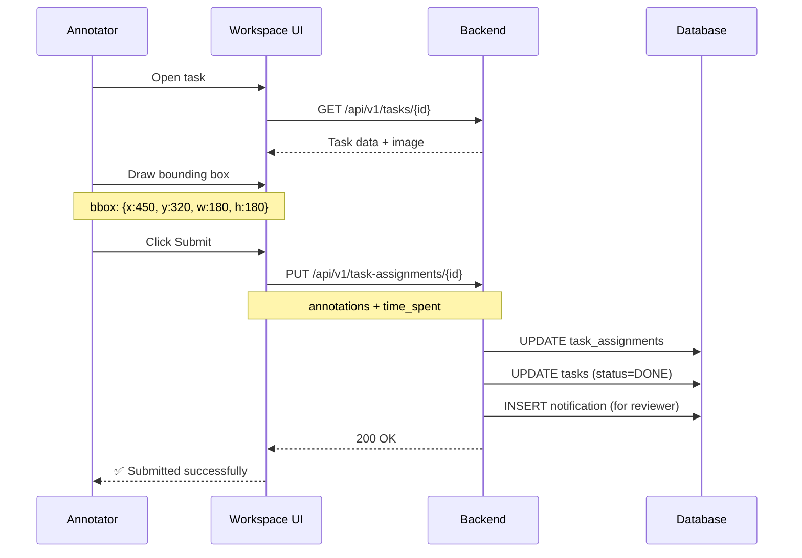
```mermaid
sequenceDiagram
    participant A as Annotator
    participant UI as Workspace UI
    participant API as Backend
    participant DB as Database
    
    A->>UI: Open task
    UI->>API: GET /api/v1/tasks/{id}
    API-->>UI: Task data + image
    
    A->>UI: Draw bounding box
    Note over A,UI: bbox: {x:450, y:320, w:180, h:180}
    
    A->>UI: Click Submit
    UI->>API: PUT /api/v1/task-assignments/{id}
    Note over UI,API: annotations + time_spent
    
    API->>DB: UPDATE task_assignments
    API->>DB: UPDATE tasks (status=DONE)
    API->>DB: INSERT notification (for reviewer)
    
    API-->>UI: 200 OK
    UI-->>A: ✅ Submitted successfully
```

**Annotation Data Structure**:
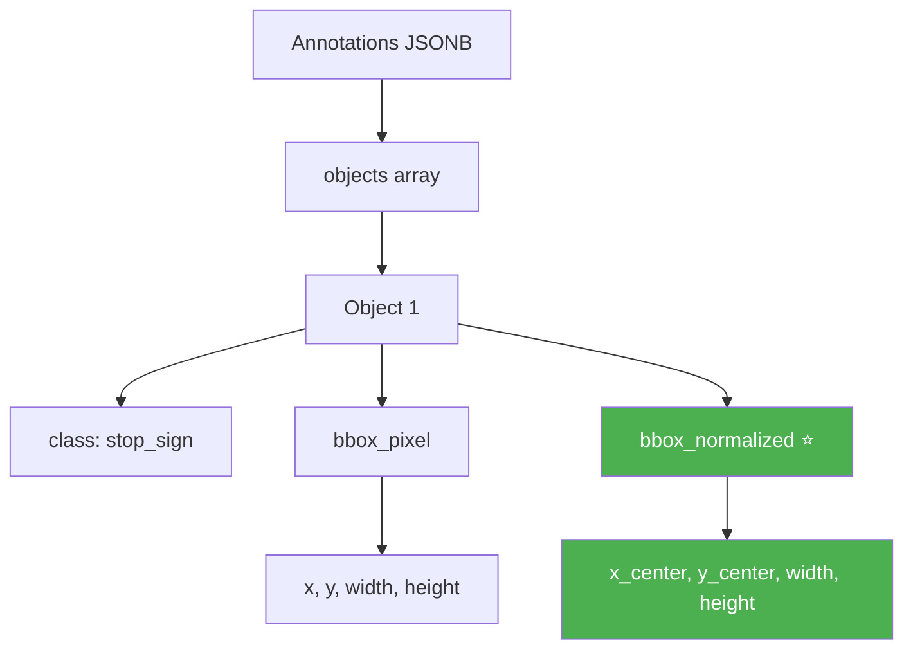
```mermaid
graph TD
    A[Annotations JSONB] --> B[objects array]
    B --> C[Object 1]
    C --> D[class: stop_sign]
    C --> E[bbox_pixel]
    C --> F[bbox_normalized ⭐]
    
    E --> G[x, y, width, height]
    F --> H[x_center, y_center, width, height]
    
    style F fill:#4caf50,color:#fff
    style H fill:#4caf50,color:#fff
```

**Database Changes**:
```sql
-- UPDATE task_assignments (status=SUBMITTED, annotations)
-- UPDATE tasks (status=DONE)
-- UPDATE user_workload (in_progress_tasks--)
-- INSERT notification (TASK_SUBMITTED)
```

---

### Bước 7: Review ✅

**Actor**: Reviewer  
**Table**: `task_assignments` (update)

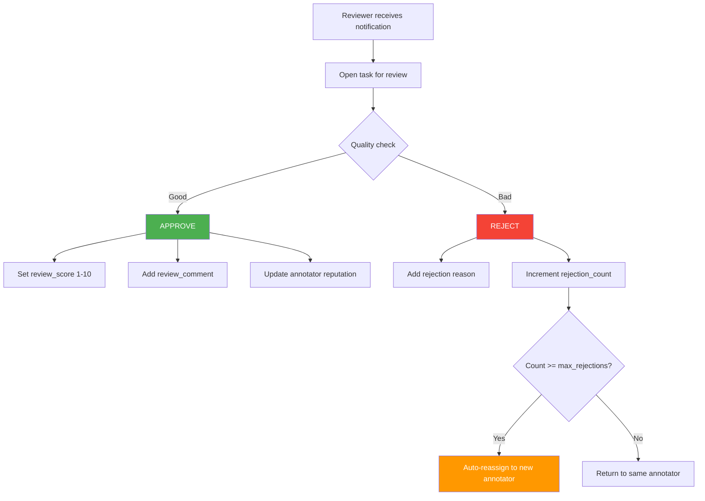
```mermaid
graph TD
    A[Reviewer receives notification] --> B[Open task for review]
    B --> C{Quality check}
    C -->|Good| D[APPROVE]
    C -->|Bad| E[REJECT]
    
    D --> F[Set review_score 1-10]
    D --> G[Add review_comment]
    D --> H[Update annotator reputation]
    
    E --> I[Add rejection reason]
    E --> J[Increment rejection_count]
    J --> K{Count >= max_rejections?}
    K -->|Yes| L[Auto-reassign to new annotator]
    K -->|No| M[Return to same annotator]
    
    style D fill:#4caf50,color:#fff
    style E fill:#f44336,color:#fff
    style L fill:#ff9800,color:#fff
```

**Approval Flow**:
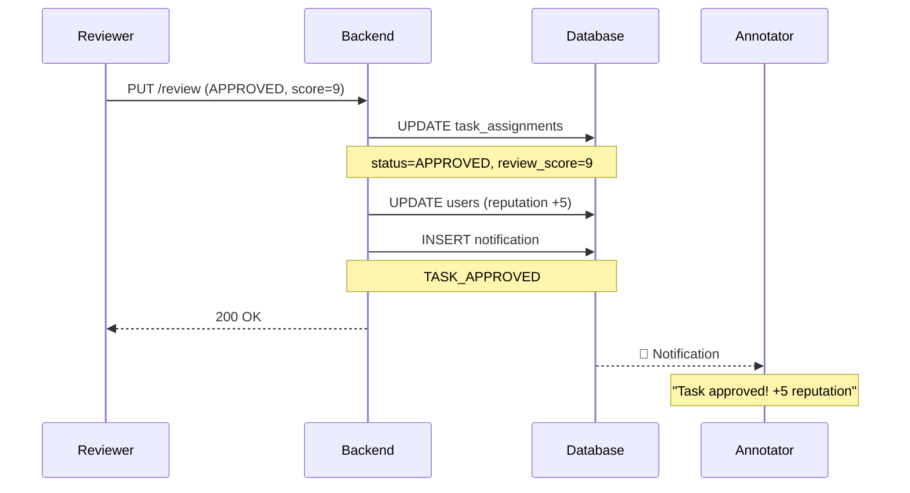
```mermaid
sequenceDiagram
    participant R as Reviewer
    participant API as Backend
    participant DB as Database
    participant A as Annotator
    
    R->>API: PUT /review (APPROVED, score=9)
    API->>DB: UPDATE task_assignments
    Note over API,DB: status=APPROVED, review_score=9
    
    API->>DB: UPDATE users (reputation +5)
    API->>DB: INSERT notification
    Note over API,DB: TASK_APPROVED
    
    API-->>R: 200 OK
    DB-->>A: 🔔 Notification
    Note over A: "Task approved! +5 reputation"
```

**Database Changes**:
```sql
-- UPDATE task_assignments (status, reviewer_id, review_score)
-- UPDATE users (reputation_score, total_tasks_done)
-- INSERT notification (TASK_APPROVED)
```

---

### Bước 8: Annotation Consensus 🎯

**Actor**: System (automatic)  
**Table**: `annotation_consensus`

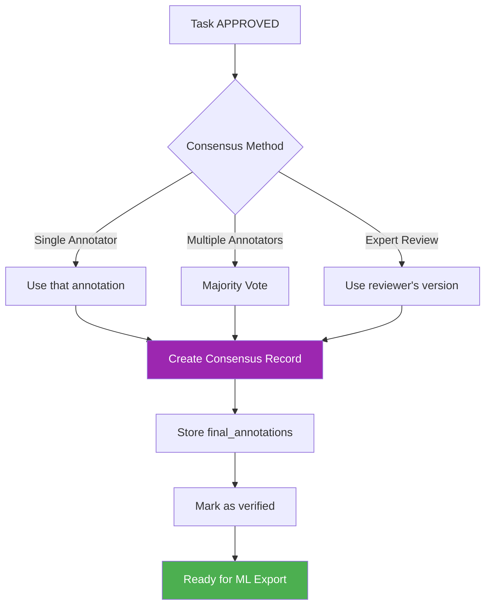
```mermaid
graph TD
    A[Task APPROVED] --> B{Consensus Method}
    B -->|Single Annotator| C[Use that annotation]
    B -->|Multiple Annotators| D[Majority Vote]
    B -->|Expert Review| E[Use reviewer's version]
    
    C --> F[Create Consensus Record]
    D --> F
    E --> F
    
    F --> G[Store final_annotations]
    G --> H[Mark as verified]
    H --> I[Ready for ML Export]
    
    style F fill:#9c27b0,color:#fff
    style I fill:#4caf50,color:#fff
```

**Consensus Data**:
```json
{
  "final_annotations": {
    "objects": [{
      "class": "stop_sign",
      "bbox_normalized": {
        "x_center": 0.281,
        "y_center": 0.370,
        "width": 0.094,
        "height": 0.167
      },
      "confidence": 1.0
    }]
  },
  "consensus_method": "single_annotator",
  "agreement_score": 1.0,
  "is_verified": true
}
```

**Database Changes**:
```sql
-- INSERT annotation_consensus
-- Link to task_id
-- Store normalized coordinates
```

---

### Bước 9: Export ML Dataset 📦

**Actor**: Manager  
**Table**: `exports`

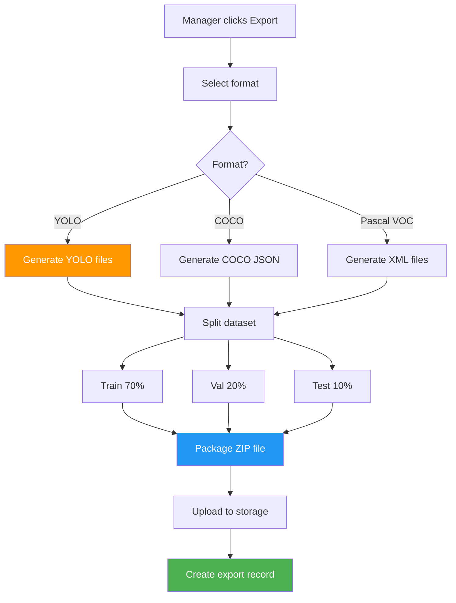
```mermaid
graph TD
    A[Manager clicks Export] --> B[Select format]
    B --> C{Format?}
    C -->|YOLO| D[Generate YOLO files]
    C -->|COCO| E[Generate COCO JSON]
    C -->|Pascal VOC| F[Generate XML files]
    
    D --> G[Split dataset]
    E --> G
    F --> G
    
    G --> H[Train 70%]
    G --> I[Val 20%]
    G --> J[Test 10%]
    
    H --> K[Package ZIP file]
    I --> K
    J --> K
    
    K --> L[Upload to storage]
    L --> M[Create export record]
    
    style D fill:#ff9800,color:#fff
    style K fill:#2196f3,color:#fff
    style M fill:#4caf50,color:#fff
```

**Export Process Flow**:
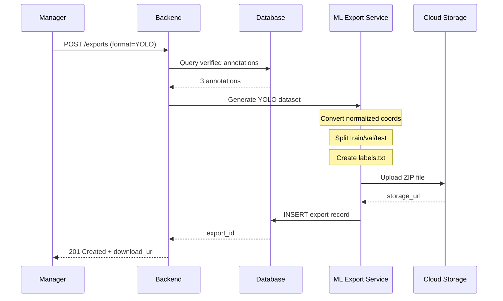
```mermaid
sequenceDiagram
    participant M as Manager
    participant API as Backend
    participant DB as Database
    participant ML as ML Export Service
    participant S3 as Cloud Storage
    
    M->>API: POST /exports (format=YOLO)
    API->>DB: Query verified annotations
    DB-->>API: 3 annotations
    
    API->>ML: Generate YOLO dataset
    Note over ML: Convert normalized coords
    Note over ML: Split train/val/test
    Note over ML: Create labels.txt
    
    ML->>S3: Upload ZIP file
    S3-->>ML: storage_url
    
    ML->>DB: INSERT export record
    DB-->>API: export_id
    API-->>M: 201 Created + download_url
```

**Export Package Structure**:
```
traffic-sign-detection-v1.zip
├── train/
│   ├── images/
│   │   └── stop_sign_001.jpg
│   └── labels/
│       └── stop_sign_001.txt
├── val/
│   ├── images/
│   └── labels/
├── test/
│   ├── images/
│   └── labels/
├── data.yaml
└── classes.txt
```

**Database Changes**:
```sql
-- INSERT exports
-- Store metadata: format, split_ratio, class_distribution
-- Track download_count
```

---

## Sơ Đồ Quan Hệ Database

### Core Workflow Chain

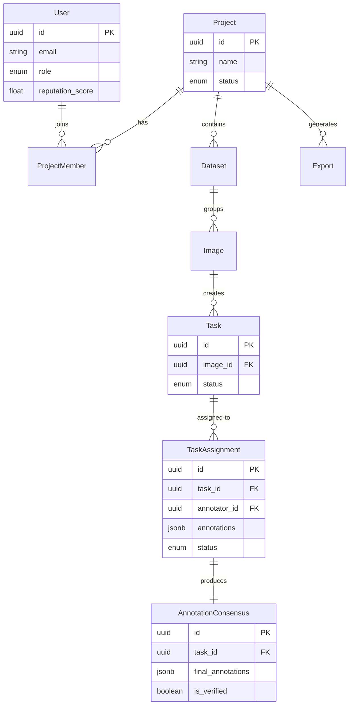
```mermaid
erDiagram
    User ||--o{ ProjectMember : "joins"
    Project ||--o{ ProjectMember : "has"
    Project ||--o{ Dataset : "contains"
    Dataset ||--o{ Image : "groups"
    Image ||--o{ Task : "creates"
    Task ||--o{ TaskAssignment : "assigned-to"
    TaskAssignment ||--|| AnnotationConsensus : "produces"
    Project ||--o{ Export : "generates"
    
    User {
        uuid id PK
        string email
        enum role
        float reputation_score
    }
    
    Project {
        uuid id PK
        string name
        enum status
    }
    
    Task {
        uuid id PK
        uuid image_id FK
        enum status
    }
    
    TaskAssignment {
        uuid id PK
        uuid task_id FK
        uuid annotator_id FK
        jsonb annotations
        enum status
    }
    
    AnnotationConsensus {
        uuid id PK
        uuid task_id FK
        jsonb final_annotations
        boolean is_verified
    }
```

---

## Auto-Assignment Flow

### Detailed Assignment Logic

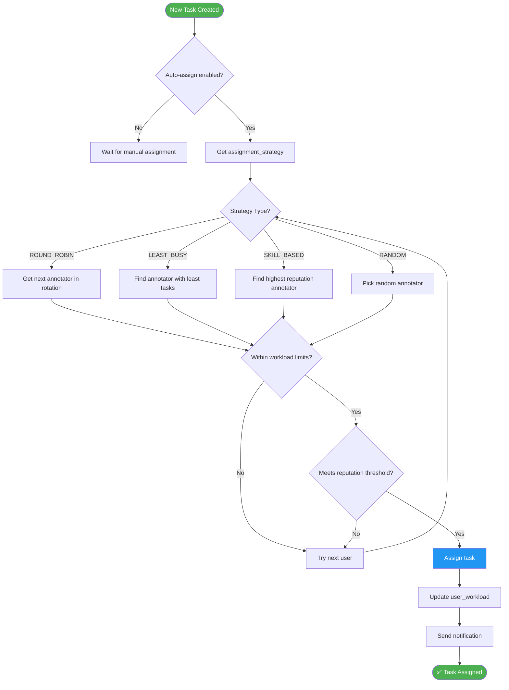
```mermaid
flowchart TD
    Start([New Task Created]) --> CheckRule{Auto-assign enabled?}
    CheckRule -->|No| Manual[Wait for manual assignment]
    CheckRule -->|Yes| GetStrategy[Get assignment_strategy]
    
    GetStrategy --> Strategy{Strategy Type?}
    
    Strategy -->|ROUND_ROBIN| RR[Get next annotator in rotation]
    Strategy -->|LEAST_BUSY| LB[Find annotator with least tasks]
    Strategy -->|SKILL_BASED| SB[Find highest reputation annotator]
    Strategy -->|RANDOM| RD[Pick random annotator]
    
    RR --> CheckLimits
    LB --> CheckLimits
    SB --> CheckLimits
    RD --> CheckLimits
    
    CheckLimits{Within workload limits?}
    CheckLimits -->|No| NextUser[Try next user]
    NextUser --> Strategy
    
    CheckLimits -->|Yes| CheckRep{Meets reputation threshold?}
    CheckRep -->|No| NextUser
    CheckRep -->|Yes| Assign[Assign task]
    
    Assign --> UpdateWorkload[Update user_workload]
    UpdateWorkload --> SendNotif[Send notification]
    SendNotif --> End([✅ Task Assigned])
    
    style Start fill:#4caf50,color:#fff
    style Assign fill:#2196f3,color:#fff
    style End fill:#4caf50,color:#fff
```

---

## Quality Control Flow

### Review & Rejection Handling

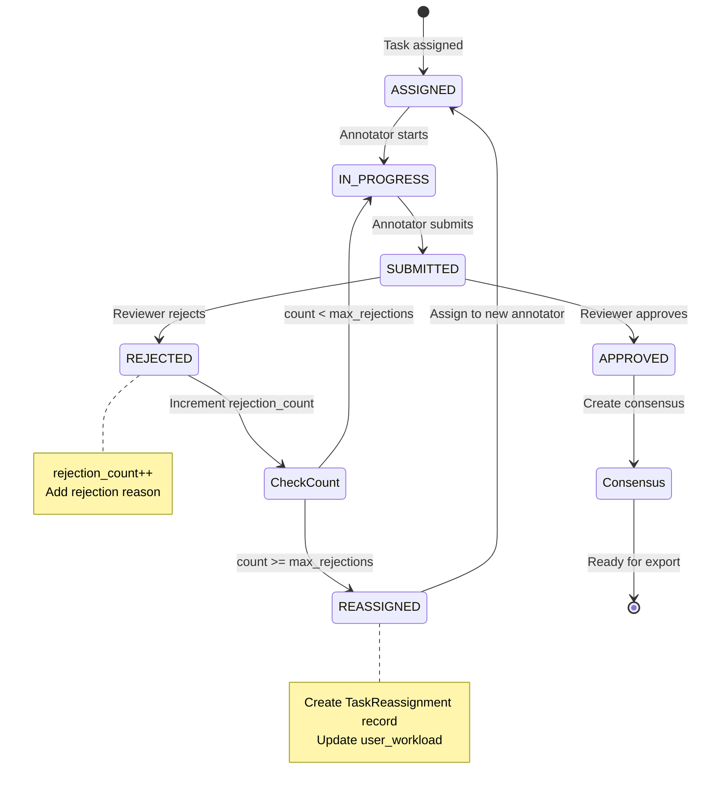
```mermaid
stateDiagram-v2
    [*] --> ASSIGNED: Task assigned
    ASSIGNED --> IN_PROGRESS: Annotator starts
    IN_PROGRESS --> SUBMITTED: Annotator submits
    
    SUBMITTED --> APPROVED: Reviewer approves
    SUBMITTED --> REJECTED: Reviewer rejects
    
    REJECTED --> CheckCount: Increment rejection_count
    CheckCount --> REASSIGNED: count >= max_rejections
    CheckCount --> IN_PROGRESS: count < max_rejections
    
    REASSIGNED --> ASSIGNED: Assign to new annotator
    
    APPROVED --> Consensus: Create consensus
    Consensus --> [*]: Ready for export
    
    note right of REJECTED
        rejection_count++
        Add rejection reason
    end note
    
    note right of REASSIGNED
        Create TaskReassignment record
        Update user_workload
    end note
```

---

## Ví Dụ Thực Tế

### Case Study: Traffic Sign Detection Project

**Thông tin project**:
- **Tên**: Traffic Sign Detection
- **Dataset**: 100 images từ highway cameras
- **Team**: 1 Manager + 5 Annotators + 2 Reviewers
- **Timeline**: 2 tuần

**Workflow Statistics**:

```mermaid
pie title Task Distribution
    "Completed" : 85
    "In Progress" : 10
    "Rejected & Reassigned" : 5
```

**Performance Metrics**:

```mermaid
graph LR
    A[100 Tasks] --> B[85 Approved]
    A --> C[10 In Progress]
    A --> D[5 Rejected]
    
    B --> E[Avg Score: 8.5/10]
    B --> F[Avg Time: 3.2 min/task]
    
    D --> G[Reassigned to experts]
    
    style B fill:#4caf50,color:#fff
    style D fill:#f44336,color:#fff
```

---

## Tổng Kết

### Key Takeaways

1. **Normalized Coordinates**: Luôn lưu cả pixel và normalized coordinates
2. **Image Dimensions**: Width/height trong `images` table là CRITICAL cho ML export
3. **Consensus**: Final annotation được lưu riêng để dễ export
4. **Workload Balancing**: System tự động cân bằng workload
5. **Audit Trail**: Mọi action đều có timestamp và actor_id
6. **Quality Control**: Multi-level review với rejection handling

### Database Records Created

| Table | Records | Purpose |
|-------|---------|---------|
| `projects` | 1 | Project definition |
| `project_members` | 4 | Team composition |
| `datasets` | 1 | Image grouping |
| `images` | 3 | Image metadata |
| `tasks` | 3 | Annotation tasks |
| `assignment_rules` | 1 | Auto-assign config |
| `user_workload` | 2 | Workload tracking |
| `task_assignments` | 3 | Task assignments |
| `notifications` | 4+ | User notifications |
| `annotation_consensus` | 3 | Final annotations |
| `exports` | 1 | ML dataset |
| **TOTAL** | **26+** | **Complete workflow** |

---

## Tài Liệu Liên Quan

- [Database Schema](./04_database.md)
- [ERD Diagram](./ERD_Diagram_Phase2.md)
- [API Documentation](./05_api.md)
- [Use Cases](./11_use_cases.md)

---

**Maintained by**: V-Label Development Team  
**Last Updated**: 2026-01-24
