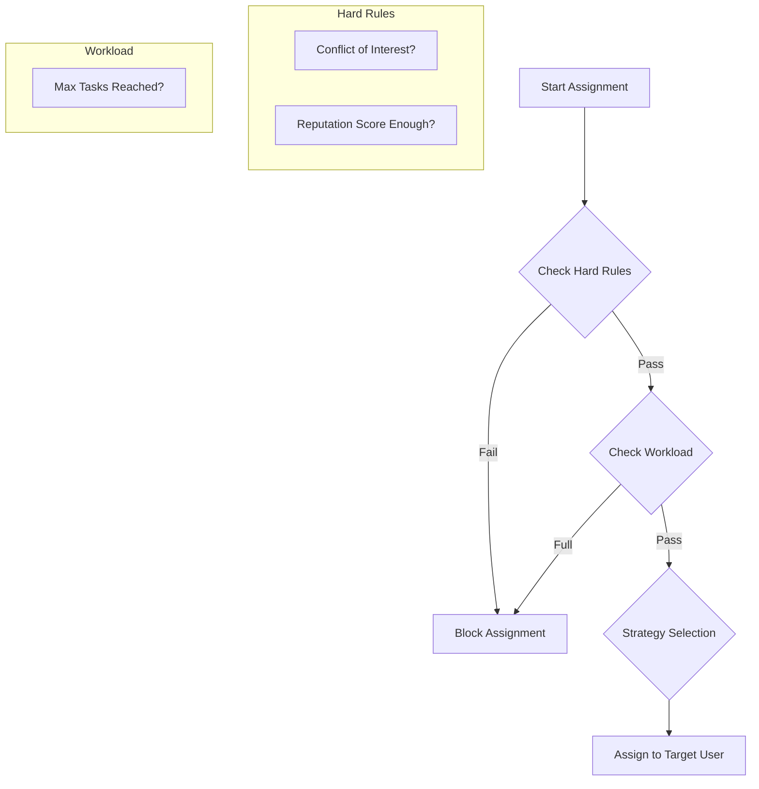

# Project Assignment Rules Logic Guide

> **Note for Developers**: This document serves as the **Technical Specification** for the Task Assignment System. It defines *how* tasks are distributed to users and *what constraints* must be checked before assignment.

## 1. Context & Problem Statement

**Why do we need this?**
In a crowdsourcing labeling platform, we cannot simply let everyone pick any task, nor can we randomly assign tasks without controls. We need to balance:
*   **Quality**: Ensuring difficult tasks go to experienced annotators.
*   **Fairness**: Preventing one user from "hoarding" all easy tasks.
*   **Speed**: Ensuring tasks are reviewed promptly.
*   **Integrity**: Preventing users from reviewing their own work (Conflict of Interest).

**The Goal**: Implement a robust `TaskService` that acts as a "Gatekeeper" for every task assignment/submission event.

## 2. User Flows & Decision Logic

### High-Level Assignment Flow
When the System (Auto-Assign) or a Manager attempts to assign a task:



## 3. Data Model Reference

Relationships: `Project` 1-to-1 `AssignmentRule`.

```prisma
model AssignmentRule {
  isAutoAssignEnabled     Boolean @default(true)
  assignmentStrategy      String  @default("ROUND_ROBIN") // ROUND_ROBIN, LEAST_BUSY, RANDOM
  
  // Workload Limits
  maxTasksPerAnnotator    Int     @default(10)
  maxTasksPerReviewer     Int     @default(5)
  
  // Quality Control & Reputation
  minAnnotatorReputation  Int     @default(0)   // [NEW] Filter by skill
  minReviewerReputation   Int     @default(0)   // [NEW] Filter by skill
  maxRejectionsBeforeReassign Int   @default(3)
  autoReassignOnSkip      Boolean @default(true)
  
  // Reviewer Specific
  autoAssignReviewer      Boolean @default(false)
  reviewerDelayHours      Int     @default(0)   // [NEW] Wait time before review
}
```

## 4. Core Implementation Logic

### A. Workload Limits (The Basics)
**Goal:** Prevent burnout and hoarding.
*   **Logic:** Before assigning, `COUNT(tasks WHERE status=IN_PROGRESS AND user=target)`.
*   **Check:** `Current < Max Limit`.

### B. Reputation Filtering (Quality Gate)
**Goal:** Ensure complex projects are only touched by experienced users.
**Logic:**
```typescript
async function checkReputationRequirements(userId: string, rule: AssignmentRule, role: 'ANNOTATOR' | 'REVIEWER') {
    const userStats = await getUserStats(userId); // Hypothetical service to get reputation score
    
    if (role === 'ANNOTATOR' && userStats.reputation < rule.minAnnotatorReputation) {
        throw new Error(`Reputation too low. Required: ${rule.minAnnotatorReputation}`);
    }
    
    if (role === 'REVIEWER' && userStats.reputation < rule.minReviewerReputation) {
        throw new Error(`Reviewer reputation too low. Required: ${rule.minReviewerReputation}`);
    }
    return true;
}
```

### C. Conflict of Interest (Self-Review Prevention)
**Goal:** A user CANNOT review their own work. This is a hard rule, often hardcoded but part of assignment logic.
**Logic:**
```typescript
async function canAssignReviewer(taskId: string, reviewerId: string) {
    const task = await getTask(taskId);
    
    // The annotator cannot be the reviewer
    if (task.assigneeId === reviewerId) {
        return false;
    }
    
    // [Advanced] Also check if they were a previous annotator on this task (if task has history)
    const history = await getTaskHistory(taskId);
    if (history.some(h => h.userId === reviewerId)) {
        return false; 
    }
    
    return true;
}
```

### D. Reviewer Delay (Cool-down)
**Goal:** Give annotators time to double-check their work, or simply pace the review flow.
**Logic:**
If `reviewerDelayHours > 0`, when a task is submitted at `2:00 PM`, it becomes available for review ONLY after `2:00 PM + Delay`.
*   **Implementation:** The query finding "Tasks available for review" must include:
    `WHERE submittedAt < (NOW() - reviewerDelayHours)`

### E. Assignment Strategies

1.  **ROUND_ROBIN**: Time-based rotation.
    *   *Logic:* Find the user who received a task *least recently*.
    *   `ORDER BY lastTaskAssignedAt ASC` -> Pick Top 1.

2.  **LEAST_BUSY**: Load balancing.
    *   *Logic:* `ORDER BY activeTaskCount ASC` -> Pick Top 1.

3.  **RANDOM**: Probability distribution.
    *   *Logic:* `Math.random()`.

4.  **[Advanced] SKILL_MATCHING**:
    *   *Logic:* Prioritize users whose "Top Tags" match the Task's required domain (requires advanced User tagging).

## 5. Advanced Scenarios (Future Proofing)

### F. Consensus / Overlap (Gold Standard)
**Goal:** Assign the *same* task to multiple people (e.g., 3 people) to verify ground truth.
*   **Logic:**
    1.  Task has a `requiredConsensus: 3` field.
    2.  `assignTask` does not lock the task for others until 3 unique users have picked it.
    3.  Final label is determined by voting (majority wins).

### G. "Cherry Picking" vs "Push"
*   **Pull (Cherry Pick)**: Users browse a list and pick tasks.
    *   *Rules apply as filters*: "You can't see this task because your score is too low."
*   **Push (Auto-Assign)**: System forces a task into the user's queue.
    *   *Rules apply as constraints*: "System skips User A because they are full."

## 6. Integration Map

When writing `TaskService`, apply rules in this order:

1.  **Hard Filters** (Absolute blockers):
    *   Conflict of Interest (Self-review).
    *   Reputation Score.
2.  **Soft Filters** (Temporary blockers):
    *   Workload Limits (Full queue).
    *   Reviewer Delay (Not ready yet).
3.  **Sorting/Selection** (Tie-breakers):
    *   Strategy (Round Robin vs Least Busy).

```typescript
// Pseudocode for fetching the Next Assignee
function findNextAssignee(project, task) {
    const candidates = project.members.filter(m => m.role === 'ANNOTATOR');
    
    // 1. Filter unqualified
    const qualified = candidates.filter(c => checkReputation(c, project.rules));
    
    // 2. Filter busy/conflicted
    const available = qualified.filter(c => 
        !isSelf(c, task) && 
        getWorkload(c) < project.rules.maxTasks
    );
    
    // 3. Sort by Strategy
    if (project.rules.strategy === 'ROUND_ROBIN') {
        return sortByLastAssigned(available)[0];
    } else {
        return sortByWorkload(available)[0]; // LEAST_BUSY
    }
}
```
